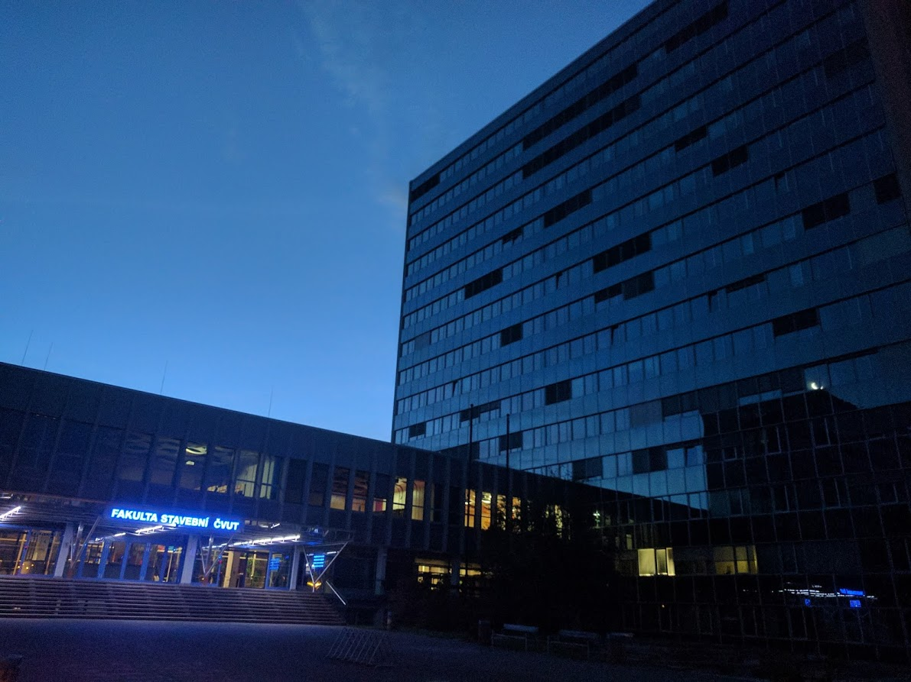

<style>
img[alt$="photo"] { width: 250px; float: right; vertical-align: top; padding-left: 15px;}
</style>

```{r setup, include=FALSE}
knitr::opts_chunk$set(echo = FALSE)
```

<br/>

**Konrad Siek**  

<hr/>

Emails: 

  - <a href="mailto:siekkonr🐒fit.cvut.cz">siekkonr🐒fit.cvut.cz</a>
  - <a href="mailto:konrad.siek🐒cs.put.edu.pl">konrad.siek🐒cs.put.edu.pl</a>

<hr/>

Probable physical locations: 

  - A 1254, Fakulta Stavební, CTU in Prague
  - 330 WVH, Northeastern
  
<hr/>  
  
Profiles:

  - [LinkedIn](https://pl.linkedin.com/in/konrad-siek-125b5a90)
  - [ResearchGate](https://www.researchgate.net/profile/Konrad_Siek)
  - [GitHub](https://github.com/kondziu)

<hr/>  
  
Websites: 

  - [www.cs.put.poznan.pl/ksiek/](http://www.cs.put.poznan.pl/ksiek/)
  - [grittyscripts.blogspot.com](http://grittyscripts.blogspot.com/)