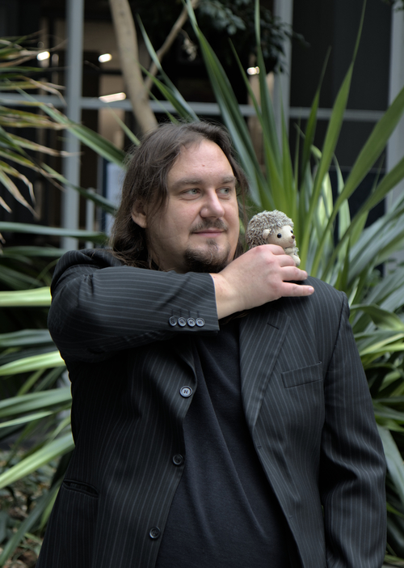

<!-- compile:
     pandoc -s cv.md -o cv.html -c css/davewhipp-screen.css 
-->

<link rel="stylesheet" href="css/davidwhipp-screen.css">

konrad.siek🐌gmail.com

 

*I explain things*  
*I write code, I write prose, I do sketchy things to runtimes*  
*I solve simple problems in complicated ways*  
*I abstract*  

## Summary

My **core interests** are  
‣ programming languages, especially abstractions and runtimes  
‣ concurrency, especially transactions  
‣ processing large data  
‣ distributed systems

My **skills** include  
‣ research and synthesis  
‣ programming in numerous languages  
‣ teaching  
‣ technical writing  

I **program** in  
‣ (currently) Rust, C, R, Bash  
‣ (previously) Scala, Python, Java, OCaml  
‣ (intermittently) numerous others

I **speak**  
‣ (proficiently) English and Polish   
‣ (learning) Czech and French

<!--
## Skills

Teaching, research, technical writing

Programming in 
‣ `Up-to-date` Rust, C, R, Bash  
‣ `Rusty` Scala, Java, Python, OCaml, and numerous others  
-->

## Education

`January 2017` 
**Doctorate** in **Computing Science** at [Poznań University of Technology](http://www.put.poznan.pl/)  
Dissertation: [*Distributed pessimistic transactional memory: algorithms and properties*](https://kondziu.github.io/pub/dissertation.pdf)  
Advisor: Paweł T. Wojciechowski  
Reviewers: Marek Tudruj, Michel Raynal

`September 2009`
**Master’s** in **Computing Science** (Software Engineering) at [Poznań University of Technology](http://www.put.poznan.pl/)  
Thesis: *A Java source code precompilation tool for static analysis and modification of programs for the Atomic RMI library*  
Advisor: Paweł T. Wojciechowski  

`February 2008`
**Bachelor of Engineering** in **Computing Science** at [Poznań University of Technology](http://www.put.poznan.pl/)  
Thesis: *Amebae: a group instant messenger for developers* (co-author)  
Advisor: Bartosz Walter

`June 2007`
**Bachelor of Arts** in **English Philology** at [PWSZ in Piła](https://puss.pila.pl/)  
Thesis: *Computer-assisted language learning software: experimental study*   
Advisor: Anna Szczepaniak-Kozak  

## Employment

`2017–2022`
**Post-doc researcher** at [Programming Research Lab](https://prl-prg.github.io/) at [Czech Technical University in Prague](https://www.cvut.cz/)  
‣ Analysis of large code repositories  
‣ Larger than memory object abstraction for R  
‣ R runtime internals survey  
‣ Teaching

`most of 2017`
**Visiting researcher** at [Programming Research Lab](http://prl.ccs.neu.edu/) at [Northeastern University](http://www.northeastern.edu/)  
‣ Lazy evaluation in R  
‣ Teaching 

`2013–2017`
**Research assistant** at [Distributed Systems Group](http://dsg.cs.put.poznan.pl/) at [Poznań University of Technology](https://www.put.poznan.pl/)  
‣ Transactional memory safety properties  
‣ Distributed TM system implementation and benchmarking  
‣ Static analysis and code generation  
‣ Teaching  

`2009–2012`
**Developer** for IT-SOA Research Project at [Poznań University of Technology](https://www.put.poznan.pl/)  
‣ Static analysis of critical sections  
‣ Code generation and Java bytecode instrumentation  

`2008–2009`
**Developer** for [PSI Poland](https://www.psi.pl)  
‣ Database stuff for an automotive factory

`2005–2006`
**Apprentice English Language Teacher** at [Elementary School No. 4 in Piła](https://sp4.e-pila.pl/)  
‣ Teaching (under supervision)

<!--`2007`
**Volunteer** for (District Municipal Library in Piła)(https://www.biblioteka.pila.pl/)-->

## Projects

`February 2019`
[**UFOs:** Lazy larger-than-memory object arrays via userfaultfd](https://github.com/ufo-org/)  
User provides an arbitrary function to populate a chunk of memory. 
Framework allocates an area of memory and transparently executes the population function when a chunk is read or written to
Chunks are seemlessly garbage-collected and re-generated as needed. 
Example implementations generate in-memory arrays from columns in CSV files, BZIP file, and formulas
Comes with C, R, and Rust bindings  
My contribution: Back-ends, R bindings and utilities, parts of garbage collection. 

`July 2020`
[**CodeDJ:** Reproducible queries over large-scale software repositories](https://codedj-prg.github.io)  
Infrastructure for querying GitHub and similar repositories for quantitative software engineering research (especially project selection) in large code datasets. 
It prioritizes reproducibility and scalability and consists of two modules. 
*Parasite* is an incremental downloader and persistent datastore. 
*Djanco* is an in-memory database and query language embedded in Rust  
My contribution: Djanco and surrounding tooling

`February 2021`
[**FML:** A small runtime for teaching runtimes](https://github.com/kondziu/FML)  
Toy bytecode compiler and interpreter designed as a model for student implementations in a runtimes class
Runs a vaguelky ML-like toy dynamic language with objects, inheritence, dynamic dispatch and garbage collection but not much else. 
The compiler generates slightly extended Feeny bytecode (another teaching language) consisting of 17 ops and 7 internal objects  
My contribution: Everything

`July 2021`
[**Rust-delegate:** Method delegation generator macro for Rust](https://github.com/Kobzol/rust-delegate)  
A Rust macro that generates method delegation to inner fields within structs  
My constribution: Syntax for injecting arbitrary expressions as arguments ot delegated functions

`July 2018`
[**TinyTracer:** A minimalistic tracer for analyzing the composition of R objects](https://github.com/PRL-PRG/tinytracer/)  
R 3.5 runtime variant instrumented to analyze objects at garbage collection 
The tracer records the types of each object, and the types object in all the slots slots in each object 
Used to find rare and anomalous object constuction  
My contribution: Everything

`2017–2018`
[**R-dyntrace:** A dynamic tracer for R](https://github.com/PRL-PRG/R-dyntrace)  
An infrastructure for programmable probes into the R runtime. Used to perform
custom dynamic analysis of R code. Subsequently used in research into lazy
evaluation in R programs  
My contribution: Overall design and implementation of probes in the previous version

`2019–2020`
[**GHGrabber:** Small Git scraper](https://github.com/PRL-PRG/ghgrabber)  
A small multi-process bash program
that gathers basic information about a Git repositories from a list of URLs and
outputs CSV files. Used to collect large datasets for teaching and software
engineering research  
My contribution: Everything

`2010–2016`
[**AtomicRMI:** Pessimistic distributed transactional memory system over Java RMI](https://github.com/kondziu/AtomicRMI)  
Implementation of pessimistic transactional concurrency control for Java RMI
RMI objects are instrumented to 
The algorithm assigns versions to shared objects and uses them to guide how transactions lock and release them
It uses upper bounds on the number of accesses of an object within transactions to release locks early, if this is safe. 
It also uses local buffers to defer the need to synchronize transactions in specific situations  
My contribution: Optimizations to the original algorithms, most of the implementation

`2008-2016`
[**GrittyScripts** A blog collecting miscallaneous scripts](https://http://grittyscripts.blogspot.com)  
A blog presenting small useful scripts in Bash, Python, AWK,
OCaml, and other languages with some analysis of the problem and attempts at
clever solutions and dirty hacks  
My contribution: Everything

## Teaching

`2019-2021`
[**Runtime systems** (NI-RUN B202)](https://courses.fit.cvut.cz/)
at [Czech Technical University in Prague](https://www.cvut.cz/)  
Course on process virtual machines for programming languages teaching basic concepts, taxonomy of VMs, architecture of runtimes, bytecode compilation and interpretation, memory management, and just in time compilation  
Designed and taught independently

`2018`
[**Object-oriented programming** (BIE-OOP B191)](https://courses.fit.cvut.cz/BI-OOP/@B191/)
Course on the principles of object oriented programming and design in Scala with an emphasis on practical techniques for developing complex software and software engineering skills: testing, error handling, refactoring, design pattern  
My contribution: leading a lab group and lectures on object-oriented design  
Led by: [Filip Křikava](http://fikovnik.net/)

`2017`
[**Expeditions in Data Science** (DS6050)](http://janvitek.org/events/NEU/6050/)
at [Northeastern University](http://www.northeastern.edu/)  
Course on practical problems of data science projects, teaching importing, tyding and transformation of large data, statistical modelling, visualization, repeatability and reproducibility of results  
My contribution: assignments and lectures on databases  
Led by: [Jan Vitek](http://janvitek.org)  

`2017`
[**Parallel data processing in MapReduce** (DS6240)](http://janvitek.org/pdpmr/f17/)
at [Northeastern University](http://www.northeastern.edu/)  
Course on distributed processing of large data involving Hadoop and Spark, H20, and Tensorflow  
My contribution: assignment designs and lectures on pipeline processing, Spark and Hadoop  
Led by: [Jan Vitek](http://janvitek.org)  

`2014–2016`
[**Safe programming methods** (MBP)](http://www.cs.put.poznan.pl/ksiek/fp/fp.html)
at Poznań University of Technology  
Course on safe programming methods and languages in the context of concurrent and distributed systems: memory models, monitors, transactional memory, message passing, map-reduce. Labs involved a complete functional programming course in Scala explaining techniques like currying, lazy evaluation, and trampolining, as well as programming with sactors  
My contribution: designed and implementation of the functional programming sub-course as teaching associate  
Led by: [Paweł T. Wojciechowski](http://www.cs.put.poznan.pl/pawelw/)

`2016`
[**Network Programming** (SK2)](http://www.cs.put.poznan.pl/ksiek/sk2/sk2.html)
at [Poznań University of Technology](http://www.put.poznan.pl/)  
Network programming and advanced network concept course. C systems programming involving sockets and threads. Ad-hoc wireless networks, load balancing, DNS, and VLAN
My contribution: leading the labs as teaching associate, preparing course materials and assignments
Led by: Michał Sajkowski

`2012–2013`
[**Networks** (SK1)](http://www.cs.put.poznan.pl/ksiek/sk/sk.html)
at [Poznań University of Technology](http://www.put.poznan.pl/)  
Introductory course to computer networks: IP addressing, subnets, structural cabling, OSI model with details on physical, network, and transport layers, static and dynamic routing
Contribution: leading the labs as teaching associate, preparing course materials and assignments
Led by: Michał Kalewski

`2009–2016`
[**Operating systems** (SOP)](http://www.cs.put.poznan.pl/ksiek/sop/sop.html)
at [Poznań University of Technology](http://www.put.poznan.pl/)  
Introductory course to operating systems: OS definition, processor scheduling, virtual memory, I/O, and filesystems. The laboratory portion involved an introduction to Linux and Bash  
Contribution: leading the labs as teaching associate, preparing course materials and assignments  
Led by: Dariusz Wawrzyniak, Anna Kobusińska, and Michał Sajkowski  

<!--
[**Operating systems** (SOP1 labs)](http://www.cs.put.poznan.pl/ksiek/sop/sop.html)
at [Poznań University of Technology](http://www.put.poznan.pl/)  
-->

`2009–2017`
[**Basic IT** (PIN labs)](http://www.cs.put.poznan.pl/ksiek/pi/pi.html)
at [Poznań University of Technology](http://www.put.poznan.pl/)  (for Poznań University of Medical Sciences students)  
As teaching associate with lectures by Izabela Szczęch  

## Papers

`July 2021`
[**CodeDJ: Reproducible queries over large-scale software repositories**](https://drops.dagstuhl.de/opus/frontdoor.php?source_opus=14049)  
Petr Maj, Konrad Siek, Alexander Kovalenko, and Jan Vitek  
In Proceedings of ECOOP'21: European Conference on Object-Oriented Programming  
DOI: [10.4230/LIPIcs.ECOOP.2021.6](https://doi.org/10.4230/LIPIcs.ECOOP.2021.6) and artifact: [🔗](https://github.com/PRL-PRG/codedj-ecoop-artifact)

`Submitted December 2019`
**Last-use Opacity: A Strong Safety Property for Transactional Memory with Prerelease Support**  
`Accepted December 2021`
Konrad Siek, Paweł T. Wojciechowski  
Distributed Computing.  *To appear.*

`March 2018`
[**Helenos: A realistic benchmark for distributed transactional memory**](http://onlinelibrary.wiley.com/doi/10.1002/spe.2548/full)  
Paweł Kobyliński, Konrad Siek, Jan Baranowski, and Paweł T. Wojciechowski  
Journal of Software: Practice and Experience, vol. 48, issue 3    
DOI: [10.1002/spe.2548](https://doi.org/10.1002/spe.2548)

`December 2015`
[**Proving opacity of transactional memory with early release**](https://sciendo.com/article/10.1515/fcds-2015-0018)  
Konrad Siek and Paweł T. Wojciechowski  
Foundations of Computing and Decision Sciences, vol 40, issue 4   
DOI: [10.1515/fcds-2015-0018](https://doi.org/10.1515/fcds-2015-0018)

`April 2015`
[**Atomic RMI: a distributed transactional memory framework**](http://link.springer.com/article/10.1007/s10766-015-0361-x>)  
Konrad Siek and Paweł T. Wojciechowski  
In Proceedings of HLPP 2014: Symposium on High-level Parallel Programming and Applications  
International Journal of Parallel Programming, vol, 44, issue 3  
DOI: [10.1007/s10766-015-0361-x](https://doi.org/10.1007/s10766-015-0361-x)

`August 2012`
[**A formal design of a tool for static analysis of upper bounds on object calls in Java**](https://link.springer.com/chapter/10.1007/978-3-642-32469-7_13)  
Konrad Siek and Paweł T. Wojciechowski  
In Proceedings of FMICS 2012: Workshop on Formal Methods for Industrial Critical Systems <!--(co-located with FM 2012)-->    
Lecture Notes in Computer Science, vol. 7437    
DOI: [10.1007/978-3-642-32469-7_13](https://doi.org/10.1007/978-3-642-32469-7_13)
<!--[[Springer](), [PDF](pub/fmics12.pdf)]-->

<!--
`September 2010`
**Barcodes versus matrix codes: an experimental comparison of recognition quality from mobile phone camera photos**
Konrad Siek and Adam Wojciechowski
Computer Graphics: Selected Issues
-->

`October 2008`
[**Barcode scanning from mobile phone camera photos delivered via MMS: Case study**](https://link.springer.com/chapter/10.1007/978-3-540-87991-6_27)   
Adam Wojciechowski and Konrad Siek  
In Proceedings ER 2008: International Conference on Conceptual Modeling  
Lecture Notes in Computer Science, vol. 5232  
DOI: [10.1007/978-3-540-87991-6_27](https://doi.org/10.1007/978-3-540-87991-6_27)

## Short papers

`July 2021`
[**Userfault objects: transparent programmable memory**](https://conf.researchr.org/details/issta-2021/ecoop-issta-2021-icooolps/6/Userfault-Objects-Transparent-Programmable-Memory)  
Konrad Siek and Colette Kerr  
In Proceedings of ICOOOLPS'21: Workshop on Implementation, Compilation, Optimization of Object-oriented Languages, Programs and Systems  

`July 2020`
[**Larger-than-memory R**](https://www.youtube.com/watch?v=6BI5xWWDrlA)  
Konrad Siek and Colette Kerr  
In Proceedings of useR'20: The R User Conference

`October 2016`
[**Atomic RMI 2: distributed transactions for Java**](https://2016.splashcon.org/event/agere2016-atomic-rmi-2-distributed-transactions-for-java)  
Paweł T. Wojciechowski and Konrad Siek  
In Proceedings of AGERE'16: Workshop on Programming Based on Actors, Agents, and Decentralized Control

`October 2014`
[**Relaxing opacity in pessimistic transactional memory**](pub/disc14.pdf)
Konrad Siek and Paweł T. Wojciechowski  
In Proceedings of DISC'14: Symposium on Distributed Computing  

`July 2014`
[**Zen and the art of concurrency control: An exploration of TM safety property space with early release in mind**](pub/wttm14.pdf)  
Konrad Siek and Paweł T. Wojciechowski  
In Proceedings of WTTM'14: the 6th Workshop on the Theory of Transactional Memory  

`April 2014`
[**Having Your Cake and Eating it Too: Combining Strong and Eventual Consistency**](pub/papec14.pdf)  
Paweł T. Wojciechowski and Konrad Siek  
In Proceedings of PaPEC 2014: Workshop on the Principles and Practice of Eventual Consistency  

`July 2013`
[**Towards a Fully-Articulated Pessimistic Distributed Transactional Memory**](pub/spaa13.pdf)   
Konrad Siek and Paweł T. Wojciechowski  
In Proceedings of SPAA 2013: the 25th ACM Symposium on Parallelism in Algorithms and Architectures

`June 2013`
[**Rollbacks in Pessimistic Distributed TM**](srdc13-abstract.pdf)  
Paweł T. Wojciechowski and Konrad Siek  
SRDC'13: TRANSFORM Summer School on Research Directions in Distributed Computing   

`April 2012`
[**Transaction Concurrency Control via Dynamic Scheduling Based on Static Analysis**](http://www.eurotm.org/action-meetings/wtm2012/program/abstracts#Wojciechowski)  
Paweł T. Wojciechowski and Konrad Siek
In Proceedings of WTM 2012: Euro-TM Workshop on Transactional Memory 

`July 2010`
[**Statically Computing Upper Bounds on Object Calls for Pessimistic Concurrency Control**](pub/sw10.pdf)  
Konrad Siek and Paweł T. Wojciechowski  
In Proceedings of EC² 2010: Workshop on Exploiting Concurrency Efficiently and Correctly

## Supervised theses

`ongoing`
**Nilay Baranwal:** Structured printing framework  
Bachelor thesis at Czech Technical University in Prague  
As supervisor

`2021`
**Jan Jindráček:** [Usability improvements to JavaScript/ECMAScript](https://dspace.cvut.cz/handle/10467/94600)  
Master thesis at Czech Technical University in Prague  
As supervisor

`2016`
**Jakub Cieślak and Kamil Kozubal:** [Implementation of distributed transactional memory](https://sin.put.poznan.pl/theses/details/t21754)  
Engineering thesis at Poznań University of Technology  
As assistant supervisor under Paweł T. Wojciechowski 

`2015`
**Jan Baranowski:** [Benchmarks for evaluating distributed transactional memory](https://sin.put.poznan.pl/theses/details/t12628)
Master thesis at Poznań University of Technology  
As assistant supervisor under Paweł T. Wojciechowski

`2015`
**Martin Witczak:** [Atomic Café—A distributed multimedia playback system](https://sin.put.poznan.pl/theses/details/t12810)  
Master thesis at Poznań University of Technology  
As assistant supervisor under Paweł T. Wojciechowski

## Volunteer and organizational work

`2019`
[**ETAPS'19:** European Joint Conferences on Theory and Practice of Software](https://conf.researchr.org/home/etaps-2019)  
Role: poster chair

`2018`
[**SPLASH'18:** Systems, Programming, Languages, and Applications: Software for Humanity](https://2018.splashcon.org/)  
Role: poster chair

`2015`
[**COST Action IC1001:** Transactional Memories: Foundations, Algorithms, Tools, and Applications](http://www.eurotm.org/)  
Role: management comittee substitute member for Poland

`2014–2016`
[**PIWO:** Poznańska Impreza Wolnego Oprogramowania (Poznań Free Software Meetup)](https://www.facebook.com/piwo.poznan/)  
Role: lead organizer and resurector

`2012–2016`
[**KN SKISR:** Koło Naukowe Sieci Komputerowych i Systemów Rozproszonych (Networks and Distributed Systems Student Club)](https://www.facebook.com/knskisr/)  
Role: faculty organizer

`2007`
[**District Municipal Public Library in Piła CMS system**](https://www.biblioteka.pila.pl/)  
Role: developement and deployment for a content manmagement system for the local library website

Popular science talks and programming courses:  
 
‣ [*Remedial scala*](https://courses.fit.cvut.cz/BI-OOP/@B191/labs/remedial-scala.html) `2019`  
‣ [*Transactional safety primer (aka Konrad does Transactions)*](https://kondziu.github.io/talks/opacity/slides.html) `2018`  
‣ [*System Aktorów (Actor Systems)*](http://www.cs.put.poznan.pl/ksiek/talks/actors.html) `2016`  
‣ [*Podstawy Programowania w Pythonie (Basics of Python Programming)*](http://www.cs.put.poznan.pl/ksiek/talks/python.html) `2015`  
‣ [*Programowanie Funkcyjne w Pythonie (Functional Programming in Python)*](http://www.cs.put.poznan.pl/ksiek/talks/python.html) `2013`  
‣ [*Warsztat Python (Python Workshop)*](https://dsg.cs.put.poznan.pl/wiki/pythonwarsztat) `2013`  
‣ [*Bezbolesne Programowanie Współbieżne (Painless Concurrent Programming)*](http://www.cs.put.poznan.pl/ksiek/talks/painless.html) 
`2012, 2014`  

## Hobbies

Inking (like drawing, but with ink)  
Taking overexposed photos  
Uncool musical instruments  
Bad sci-fi audiobooks  
Explaining how language works    
Kendo for one summer and then never again  
