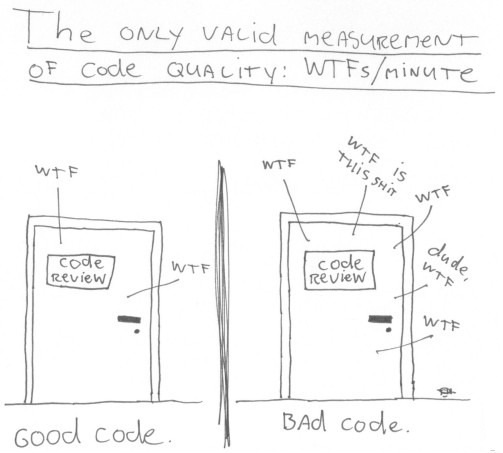

# How to write good software?

# How to write good code?

## What even is good code?

##

> I know it when I see it

<div style="font-size: medium !important;">SCOTUS Justice Potter Stewart's obscenity test</div>

## Which is better?

``` scala
def isLastDayInMonth(year: Int, month: Int, day: Int) = 
  if (month < 8) && (month % 2 != 0) day == 31 
  else if (month > 7) && (month % 2 == 0) day == 31
  else if (month == 2) && isLeapYear(year) day == 29
  else if (month == 2) day == 28
  else day == 30
```

``` scala
def isLastDayInMonth(year: Int, month: Int, day: Int) = 
  month match {
    case 1 => day == 31
    case 2 if isLeapYear(year) => day == 29
    case 2 if !isLeapYear(year) => day == 28
    case 3 => day == 31
    case 4 => day == 30
    case 5 => day == 31
    case 6 => day == 30
    case 7 => day == 31
    case 8 => day == 31
    case 9 => day == 30
    case 10 => day == 31
    case 11 => day == 30
    case 12 => day == 31
  }
```

## ⭐ Good code is explicit and expressive ⭐

## Which is better?

``` scala
def convert(list: List[String]) = {
  val buffer = new ListBuffer[Int]()
  for (string <- list) {
    buffer += string.toInt
  }
  buffer.toList
}
```

``` scala
def convert(list: List[String]) = 
  list.map {string => string.toInt}
```

## ⭐ Good code is concise ⭐

(Avoids unnecessary complexity)

## Which is better?

``` scala
def convertToString[T](list: List[T]) = {
  def inner(list: List[T], accumulator: List[String]): List[String] =
    list match {
      case h::tail => inner(tail, accumulator:+h.toString)
      case Nil => accumulator
    }
  inner(list, Nil) 
}
def convertToLowercase(strings: List[String]) = {
  def inner(strings: List[String], list: List[String]): List[String] =
    strings match {
      case h::tail => inner(tail, list:+h.toLowerCase)
      case Nil => list
    }
  inner(strings, Nil) 
}
```

or...

##

``` scala
def map [T1, T2](op: (T1 => T2))(list: List[T1]): List[T2] = {
  def inner(list: List[T1], accumulator: List[T2]): List[T2] =
    list match {
      case h::tail => inner(tail, accumulator:+op(h))
      case Nil => accumulator
    }
  inner(list, Nil) 
}

def convertToString[T] = map((e: T) => e.toString) _ 
def convertToLowercase = map((s: String) => s.toLowerCase) _
```

## ⭐ Don't Repeat Yourself ⭐

Generalize and use abstractions

## Which is better?

``` scala
getinvcdlmt(acc)
```

``` scala
getInvoicableCreditLimit(account)
```

## ⭐ Entities have meaningful names ⭐ 

## Good code is readable

> Indeed, the ratio of time spent reading versus writing is well over 10 to 1. We are constantly reading old code as part of the effort to write new code. 

> So if you want to go fast, if you want to get done quickly, if you want your code to be easy to write, make it easy to read.

<div style="font-size: medium !important;">Robert C. Martin. *Clean Code: A Handbook of Agile Software Craftsmanship.*
</div>


## Code is for communication with humans

> The computer doesn’t care whether your code is readable. It’s better at reading binary machine instructions than it is at reading high-level-language statements. 

> It’s easier to be sure your code works if you can easily read what you wrote.

> You write readable code because it helps other people to read your code.

<div style="font-size: medium !important;">Steve McConnel. *Code Complete.*
</div>

## You know it's true



## Readability vs optimization

## Which is better?

``` scala
val x = 0x5f3759df - (i >> 2)
```

``` scala
val x = 1.0 / Math.sqrt(i)
```

<div style="font-size: medium !important;">
John Carmack's Fast Inverse Square Root formula (Quake III)
</div>

## Which is better?

``` scala
// ~40ms for 1M Ints
val x = 0x5f3759df - (i >> 2)
```

``` scala
// ~31ms for 1M Ints
val x = 1.0 / Math.sqrt(i)
```

## ⭐ Understand the problem and the solution ⭐

## This might look familiar...

``` scala
def count(list: List[Int]): Int = {
  @tailrec
  def inner(list: List[Int], count: Int): Int =
    list match {
      case _::tail => inner(tail, count + 1)
      case Nil => count
    }
  inner(list, 0)
}
```

``` scala
def sum(list: List[Int]): Int = {
  @tailrec
  def inner(list: List[Int], sum: Int): Int =
    list match {
      case head::tail => inner(tail, sum + head)
      case Nil => sum
    }
  inner(list, 0)
}
```

## Which is better?

``` scala
def mean(list: List[Int]): Double = sum(list)/count(list)
```

``` scala
def mean(list: List[Int]): Double = {
  @tailrec
  def inner(list: List[Int], sum: Int, count: Int): Double =
    list match {
      case head::tail => inner(tail, sum + head, count + 1)
      case Nil => sum/count
    }
  inner(list, 0, 0)
}
```

## Which is better?

``` scala 
// ~14ms for 1M Ints
def mean(list: List[Int]): Double = sum(list)/count(list) 
```

``` scala
// ~8ms for 1M Ints
def mean(list: List[Int]): Double = {                     
  @tailrec
  def inner(list: List[Int], sum: Int, count: Int): Double =
    list match {
      case head::tail => inner(tail, sum + head, count + 1)
      case Nil => sum/count
    }
  inner(list, 0, 0)
}
```

## ⭐ You are not Google ⭐ 

##

> Kafka was designed to handle the throughput of all the analytics events at LinkedIn: one trillion events per day. 

> One student’s company had chosen to architect their system around Kafka. Their business processed just a few dozen transactions per day. At this throughput, the datastore could be a human writing into a physical book.

<div style="font-size: medium !important;">Oz Nova. *You are not Google.* https://blog.bradfieldcs.com/you-are-not-google-84912cf44afb
</div>


## ⭐ Take responsibility for optimization ⭐ 

``` scala
/*
 * This calculates 1/√i using the approximate fast inverse 
 * square root formula for 32bit integers from Quake III Arena. 
 * Microbenchmarks show that using it here drops performance 
 * by about 20%, but we get a performance benefit when running 
 * the application due to cache miss elimination. Since this is
 * a bottle neck this performance bump is important. Refactor 
 * with care.
 * 
 * More: https://en.wikipedia.org/wiki/Fast_inverse_square_root
 */
val x = 0x5f3759df - (i >> 2)
```

## Which is better?

``` scala
abstract class Animal
case class Cat() extends Animal
case class Wolf() extends Animal
case class Snake() extends Animal
```

``` scala
object Noise {
  def noise(animal: Animal): String  =
    animal match {
      case Wolf() => "Awoo"
      case Snake() => "Sssss"
      case _ => throw new IllegalArgumentException
    }
}
```

``` scala
object Limbs {
  def legs(animal: Animal): Int =
    animal match {
      case Wolf() => 4
      case Snake() => 0
      case _ => throw new IllegalArgumentException
    }
}
```

or...

## Which is better?

``` scala
abstract class Animal {
  def noise: String
  def legs: Int
}
case class Wolf() extends Animal {
  override def noise = "Awoo"
  override def legs = 4
}
case class Snake() extends Animal {
  override def noise = "Sssss"
  override def legs = 0
}
```

```scala
object Noise {
  animal.noise
}
```

```scala
object Limbs {
  animal.legs
}
```

## How many places change? 

See also: dependency graph

## How many places will you forget to change? 

## Pantha rhei

> In the practical world of computing, it is rather uncommon that a program, once it performs correctly and satisfactorily, remains unchanged forever.

<div style="font-size: medium !important;">
Niklaus Wirth. *Program Development by Stepwise Refinement* 
</div>

## ⭐ Code for the future ⭐ 

## The story so far... 

- Good code is readable

    - Good code is explicit and expressive
    - Don't Repeat Yourself (generalizing abstractions)
    - Entities have meaningful names
    - Take responsibility for optimization
    - You are not Google  

- Code for the future

##  Good code is maintainable

> Fact 41  
  Maintenance typically consumes 40 to 80 percent of software costs. Therefore, it is probably the most important life cycle phase of software.

<div style="font-size: medium !important;">Robert L. Glass. *Facts and Fallacies of Software Engineering.* </div>


<!--
## Tools for writing good code

  - Empathy
  - Code review
  -->

# How to write objects?

## What are objects?

<div style="float: left; width: 50%;">
  

  
</div><div style="float: left; width: 50%;">
  

  
</div>

<div style="font-size: medium !important;">image source: https://docs.oracle.com/javase/tutorial/</div>

## Why use objects?

> Object-oriented programming is about organization.

<div style="font-size: medium !important;">Ryan Culpeper</div>

# How to use objects? (in principle)

## What can go wrong?

> There can be two kinds of infractions to organization:

> Mixing too many things together

> Spreading things too far apart

<div style="font-size: medium !important;">Ryan Culpeper</div>

## Symptoms of rotting design

- rigidity
- fragility
- immobility
- viscosity

## Rigidity

- Difficult to change,
- Changes cascade.

## Fragility

Changes break code in many places, non-local errors.

## Immobility

Can't reuse code from other projects or elsewhere in same project.

## Design viscosity

Easier to hack around the our framework than to do it right.

```scala
// It would be too complex to use our Dependency 
// Injection framework here, so let's create new 
// instances directly for now. It makes it impossible 
// to run unit tests for this class, so beware of 
// regressions.
// TODO: Use Dependency Injection and add unit tests.
```

## Environment viscosity

- Slow compile time,
- Restrictions on fixing problems.

## SOLID Design principles

- **S**ingle resposibility
- **O**pen-closed
- **L**iskov substitution
- **I**nterface segregation
- **D**ependency inversion

<div style="font-size: medium !important;">Robert C. Martin. *Clean Code: A Handbook of Agile Software Craftsmanship.*
</div>

## Single responsibility

Do one thing and do it well.

## Bad Example

```scala
class User {
  def age = ???
  def name = ???
  def slug = ???
  def email = ???
  // Xmm why do we have them here?
  def checkAge = ???
  def validateEmail = ???
  def slugifyName = ???
}
```

## Good Example

```scala
class User {
  def age = ???
  def name = ???
  def slug = ???
  def email = ???
}
```

```scala
class UserFieldValidator(user: User)
  def checkAge = ???
  def validateEmail = ???
  def slugifyName = ???
}
```

## Open-closed

Open for extension, closed for modification.

## Bad example

```scala
 class GraphicEditor {
 
 	def drawShape(s: String) = {
 		if (s.m_type == 1)
 			drawRectangle(s);
 		else if (s.m_type == 2)
 			drawCircle(s);
 	}
 	def drawCircle(c: Circle) = { /* ... */ }
 	def drawRectangle(r: Rectangle) = { /* ... */}
}
```
 
```scala
 abstract class Shape {
 	 val m_type: Int
 }
 class Rectangle extends Shape {
	super.m_type=1
 }
 class Circle extends Shape {
 	super.m_type=2
 } 
```

## Good Example

```scala
class GraphicEditor {
 	def drawShape(s: shape) = s.draw();

}
```
 
```scala
abstract class Shape {
 	abstract def draw(): Unit
}
class Rectangle extends Shape  {
 	override def draw() = { /* ... */	}
} 
class Cirlce extends Shape  {
 	override def draw() = { /* ... */	}
} 
```

## Liskov substitution

An object of a superclass is interchangable with objects of its subclass.

## Example

``` scala
class Animal {
  def noise: String = "::animal noise::
}
case class Wolf() extends Animal {
  override def noise = "Awoo"
}
case class Snake() extends Animal {
  override def noise = "Sssss"
}
```

## Example

``` scala
class Animal {
  def noise: String "::animal noise::
  def legs: Int = throw new Exception
}
case class Wolf() extends Animal {
  override def noise = "Awoo"
  override def legs = 4
}
case class Snake() extends Animal {
  override def noise = "Sssss"
  override def legs = 0
}
```

## Interface segregation

A class shouldn't be forced to implement methods it doesn't need.

## Example

``` java
/**
 * Interface definition for a callback to be invoked when a view is clicked.
 */
public interface OnClickListener {
    /**
     * Called when a view has been clicked.
     *
     * @param v The view that was clicked.
     */
    void onClick(View v);
}/**
 * Interface definition for a callback to be invoked when a view has been clicked and held.
 */
public interface OnLongClickListener {
    /**
     * Called when a view has been clicked and held.
     *
     * @param v The view that was clicked and held.
     *
     * @return true if the callback consumed the long click, false otherwise.
     */
    boolean onLongClick(View v);
}
```

## Dependency inversion

We should be able to switch out objects that a class depends on.

# How to use objects? (in practice)

## Design patterns

## Problem

Write a function that looks for a personal record in a database by unique ID.

```scala
class Person {
  def getID = ???
  def getName = ???
  def getEmail = ???
  def getAddress = ???
}
```

```scala
def findInDB(id: Int) // TODO return type
```

## On null

> I call it my billion-dollar mistake. It was the invention of the null reference in 1965. I couldn't resist the temptation to put in a null reference, simply because it was so easy to implement. 

> This has led to innumerable errors, vulnerabilities, and system crashes, which have probably caused a billion dollars of pain and damage in the last forty years.

<div style="font-size: medium !important;">
Tony Hoare. Null References: The Billion Dollar Mistake.<br/> https://www.infoq.com/presentations/Null-References-The-Billion-Dollar-Mistake-Tony-Hoare/
</div>

## How to prevent forgetting about nulls?

The classic solution:

```scala 
abstract class Person

class ConcretePerson extends Person {
  def getID = ???
  def getName = ???
  def getEmail = ???
  def getAddress = ???
}
object NullPerson extends Person
```

## How to prevent forgetting about nulls?

The classic solution:

```scala
def findInDB(id: Int): Person

val person: Person = findInDB(42)

if (person.isInstanceOf[NullPerson]) {
  /* ... */
} else {
  val record = person.asInstanceOf[ConcretePerson]
  /* ... */
}
```

```scala
def findInDB(id: Int): Person

val person: Person = findInDB(42)

/* ... */
```

## How to prevent forgetting about nulls?

The idiomatic solution:

```scala
class Person {
  def getID = ???
  def getName = ???
  def getEmail = ???
  def getAddress = ???
}

def findInDB(id: Int): Option[Person]

val person: Person = findInDB(42)

person match {
  case Some(record) => /* ... */
  case None => /* ... */
}
```

## ⭐ Make the type checker do your work for you ⭐ 

## Design pattern: Null object

An object with no value or a value   
with defined neutral (safe) behavior.

<div style="font-size: medium !important;">
R. C. Martin, D. Riehle, F. Buschmann. Pattern Languages of Program Design. 
</div>

## How to prevent forgetting about nulls?

An even more classic solution:

```scala 
abstract class Person

class ConcretePerson extends Person {
  def getID = ???
  def getName = ???
  def getEmail = ???
  def getAddress = ???
}
object NullPerson extends Person{
  def getID = -1
  def getName = "<missing>"
  def getEmail = "<missing>"
  def getAddress = "<missing>"
}
```
 
## A Different Problem

> We have a class that keeps configuration information. The configuration can be changed at any time. How to write a class that does something whenever the configuration changes?

## An attempt

``` scala
class Observer {
  def changeColor(color: Color) = ???
}
```

``` scala
class Configuration {
  private var color: Color
  def setColor(c: Color) = {
    color = c
    observer.changeColor(c)
  }
}
```

## Why is this bad?

``` scala
class Observer {
  def changeColor(color: Color) = ???
}
```

``` scala
class AnotherObserver {
  def changeColor(color: Color) = ???
}
```

``` scala
class Configuration(observer: Observer, anotherObserver: Observer) {
  private var color: Color
  def setColor(c: Color) = {
    color = c
    observer.changeColor(c)
    anotherObserver.changeColor(c)
  }
}
```

## Why is this bad?

``` scala
class Observer {
  def changeColor(color: Color) = ???
  def changeTitle(title: String) = ???
}
```

``` scala
class AnotherObserver {
  def changeColor(color: Color) = ???
  def changeTitle(title: String) = ???
}
```

``` scala
class Configuration(observer: Observer, anotherObserver: Observer) {
  private var color: Color
  private var title: String
  def setColor(c: Color) = {
    color = c
    observer.changeColor(c)
    anotherObserver.changeColor(c)
  }
  def setTitle(s: String) = {
    string = s
    observer.changeColor(s)
    anotherObserver.changeColor(s)
  }
}
```

## A better way

``` scala
trait Observer {
  def change(property: Symbol, value: Any): Unit
}
```

``` scala
class ConcreteObserver extends Observer {
  def change(property: Symbol, value: Any) = 
    property match {
      case 'color => changeColor(value.asInstanceOf[Color])
      case 'title=> changeTitle(value.asInstanceOf[String])
    }
  def changeColor(color: Color) = ???
  def changeTitle(title: String) = ???
}
```

## A better way

``` scala
class Configuration() {
  private val observers = new mutable.Map[Symbol,Observer]
  def addObserver(operation: Symbol, observer: Observer) = 
    observers.addOne(observer)
  
  private var color: Color
  private var title: String
  def setColor(c: Color) = {
    color = c
    observers.forEach {o => o.change('color, c)} 
  }
  def setTitle(s: String) = {
    string = s
    observers.forEach {o => o.change('title, s)} 
  }
}
```

## What changes when adding new observer?

## What is coupling?

The degree of interdependence between entities.

## ⭐ Loose coupling ⭐ 

One object doesn't change or modify the state or behavior of another object.

## Observer pattern

Define a one-to-many dependency between objects so that when one object changes state, all its dependents are notified and updated automatically.

- How can a one-to-many dependency between objects be defined without making the objects **tightly coupled**?
- How can an object notify an open-ended number of other objects? 

<div style="font-size: medium !important;">
Gamma, Helm, Johnson, Vlissides (aka Gang of Four). Design Patterns: Elements of Reusable Object-Oriented Software
</div>


## Another problem

> Build a microbenchmark framework. It runs different implementations of the same algorithm with the data and measures their execution time. Each implementation is run several times in a loop.

## A naïve attempt

``` scala
def benchmark(implementation: String, data: List[Int]) {
  val results = mutable.ListBuffer[Long]
  for (i <- 0 to 2000) {
    val time = implementation.match {
      case "bogosort" => {
        val start = System.nanoTime()
        /* run bubble sort on data */
        val end = System.nanoTime()
        start - end
      }
      case "worst sort" => {
        val start = System.nanoTime()
        /* run worst sort on data */
        val end = System.nanoTime()
        start - end
      }
    }
    if (i >= 1000)  // Skip first 1000 for JVM warmup
      results :+ time
  }
}
```

## First things first: nitpicking

``` scala
def benchmark(implementation: Symbol, data: List[Int]) = {
  val results = mutable.ListBuffer[Long]
  for (i <- 0 to 2000) {
    val time = implementation.match {
      case 'bogosort => {
        val start = System.nanoTime()
        /* run bubble sort on data */
        val end = System.nanoTime()
        start - end
      }
      case 'worstsort => {
        val start = System.nanoTime()
        /* run worst sort on data */
        val end = System.nanoTime()
        start - end
      }
    }
    if (i >= 1000)  // Skip first 1000 for JVM warmup
      results :+ time
  }
}
```

## Deduplication via abstraction

``` scala
def timeExecution[T](code: => T): Long = {
  val start = System.nanoTime()
  code
  val end = System.nanoTime()
  start - end
}
```

```scala
def benchmark(implementation: Symbol, data: List[Int]) = {
  val results = mutable.ListBuffer[Long]
  for (i <- 0 to 2000) {
    val time = implementation match {
      case 'bogosort => timeExecution {
        /* run bubble sort on data */
      }
      case 'worstsort => timeExecution {
        /* run worst sort on data */
      }
    }
    if (i >= 1000)  // Skip first 1000 for JVM warmup
      results :+ time
  }
}
```

## Loop surgery

```scala
def benchmark(implementation: Symbol, data: List[Int]) =
  (0 to 2000).flatMap {
    val time = implementation match {
      case 'bogosort => timeExecution {
        /* run bubble sort on data */
      }
      case 'worstsort => timeExecution {
        /* run worst sort on data */
      }
    }
    if (i >= 1000)  // Skip first 1000 for JVM warmup
      List(time)
    else 
      List()
  }
```

## Let's deduplicate again! Step 1

```scala
def bogosort(data: List[Int]): List[Long] = ???
def worstsort(data: List[Int]): List[Long] = ???
```

``` scala
def benchmark(implementation: Symbol, data: List[Int]) =
  (0 to 2000).flatMap {
    val time = implementation match {
      case 'bogosort => timeExecution {bogosort(data)}
      case 'worstsort => timeExecution {worstsort(data)}
    }
    if (i >= 1000)  // Skip first 1000 for JVM warmup
      List(time)
    else 
      List()
  }
```

## Let's deduplicate again! Step 2

``` scala
val implementations = Map('bogosort -> (bogosort _), 
                          'worstsort -> (worstsort _))
```

``` scala
def benchmark(implementation: Symbol, data: List[Int]) =
  (0 to 2000).flatMap {
    val time = implementations(implementation)(data)
    if (i >= 1000)  // Skip first 1000 for JVM warmup
      List(time)
    else 
      List()
  }
```

## What did we gain by this?

## ⭐ Decoupling and abstraction ⭐ 

## Strategy pattern

Define a family of algorithms, encapsulate each one, and make them interchangeable. Strategy lets the algorithm vary independently from clients that use it.

- How can a class be configured with an algorithm at run-time instead of implementing an algorithm directly?
- How can an algorithm be selected and exchanged at run-time?

<div style="font-size: medium !important;">
Gamma, Helm, Johnson, Vlissides (aka Gang of Four). Design Patterns: Elements of Reusable Object-Oriented Software
</div>

## Yet another problem

> Write a system where two different types of Worker threads execute in parallel.

## Parallel workers

```scala
class WorkerA extends Runnable {
  def run() = {
    /* does something */
  }
}
class WorkerB extends Runnable {
  def run() = {
    /* does something */
  }
}
```

```scala
val threads = (i <- 1 to 10).map {new Thread(new WorkerA)} :::
              (i <- 1 to 10).map {new Thread(new WorkerB)}
               
threads.forEach {th => th.start()}
```

## Let's evolve the system!

> Add a logger to every type of woker thread

## Logging workers

```scala
class WorkerA(logger: Logger) extends Runnable {
  def run() = {
    logger.log("entering " + this)
    /* does something */
    logger.log("leaving " + this)
  }
}
class WorkerB(logger: Logger) extends Runnable {
  def run() = {
    logger.log("entering " + this)
    /* does something */
    logger.log("leaving " + this)
  }
}
```

```scala
val threads = (i <- 1 to 10).map {new Thread(new WorkerA(logger))} :::
              (i <- 1 to 10).map {new Thread(new WorkerB(logger))}
               
threads.forEach {th => th.start()}
```

## Conflicts!

``` scala
class WorkerA(logger: Logger, lock: Lock) extends Runnable {
  def run() = {
    logger.log("entering " + Thread.currentThread.getId)
    lock.synchronized {
      /* does something */
    }
    logger.log("leaving " + Thread.currentThread.getId)
  }
}
class WorkerB(logger: Logger, lock: Lock) extends Runnable {
  def run() = {
    logger.log("entering " + Thread.currentThread.getId)
    lock.synchronized {
      /* does something */
    }
    logger.log("leaving " + Thread.currentThread.getId)
  }
}
```

```scala
val threads = (i <- 1 to 10).map {new Thread(new WorkerA(logger, aLock))} :::
              (i <- 1 to 10).map {new Thread(new WorkerB(logger, bLock))}
               
threads.forEach {th => th.start()}
```

## What's wrong with this code?

## Extracting responsibility

```scala
class JustLocking(lock: Lock) {
  def run() = {
    lock.synchronized {
     /* ... */
    }
  }
}
class JustLogging(logger: Logger) {
  def run() = {  
    logger.log("entering " + Thread.currentThread.getId)
    /* ... */
    logger.log("leaving " + Thread.currentThread.getId)
  }
}
```

## Extracting responsibility


``` scala
class WorkerA(logger: Logger) extends Runnable {
  def run() = {
    /* does something */
  }
}
class WorkerB(logger: Logger) extends Runnable {
  def run() = {
    /* does something */
  }
}
```

## Making responsibility stackable

```scala
class JustLocking(lock: Lock, runner: Runnable) extends Runnable {
  def run() = {
    lock.synchronized {
      runner.run
    }
  }
}
class JustLogging(logger: Logger, runner: Runnable) extends Runnable {
  def run() = {  
    logger.log("entering " + Thread.currentThread.getId)
    runner.run
    logger.log("leaving " + Thread.currentThread.getId)
  }
}
```

## Putting it all together

```scala
val threads = (i <- 1 to 10).map {new Thread(new JustLogging(logger, 
                                             new JustLocking(aLock, 
                                             new WorkerA)))} :::
              (i <- 1 to 10).map {new Thread(new JustLogging(logger, 
                                             new JustLocking(bLock, 
                                             new WorkerB)))}
threads.forEach {th => th.start()}
```


## Decorator

Attach additional responsibilities to an object dynamically. Decorators provide a flexible alternative to subclassing for extending functionality.

- How can responsibilities be added to an object dynamically?
- How can the functionality of an object be extended at run-time?

<div style="font-size: medium !important;">
Gamma, Helm, Johnson, Vlissides (aka Gang of Four). Design Patterns: Elements of Reusable Object-Oriented Software
</div>

# Resources

## A catalogue of creational design patterns

  - Abstract factory
  - Builder
  - Factory method
  - Prototype
  - Singleton

## A catalogue of structural design patterns

  - Adapter
  - Bridge
  - Composite
  - Decorator
  - Facade
  - Flyweight
  - Proxy
  
## A catalogue of behavioral design patterns

  - Chain of responsibility
  - Command
  - Interpreter
  - Iterator
  - Mediator
  - Memento
  - Observer
  - State
  - Strategy
  - Template Method
  - Visitor
  - Dependency Injection
  
## A reference: 

The Gang of Four Design Pattern Reference
<div style="font-size: medium !important;">
http://www.w3sdesign.com/GoF_Design_Patterns_Reference0100.pdf
</div>

Richard Carr. Gang of Four Design Patterns.
<div style="font-size: medium !important;">
http://www.blackwasp.co.uk/GofPatterns.aspx
</div>

## Katas

- Strategy pattern kata
  <div style="font-size: medium !important;"> 
  http://bakingwebsites.co.uk/2013/05/07/strategy-pattern-coding-kata/
  </div>
- Observer pattern kata 
  <div style="font-size: medium !important;"> 
  https://bakingwebsites.wordpress.com/2013/05/29/the-observer-pattern-coding-kata/
  </div>
- Decorator pattern kata 
  <div style="font-size: medium !important;"> 
  https://gist.github.com/delbertlegg/1dc4ae8950c19c7c2407ec52bbd4aef0
  </div>
- Command pattern kata 
  <div style="font-size: medium !important;"> 
  https://technologyconversations.com/2014/10/17/java-tutorial-through-katas-mars-rover/
  </div>
  
# Admonishments
  
## Be careful

- Dave Cook. Design Patterns should be considered harmful. 
  <div style="font-size: medium !important;"> 
  https://medium.com/comparethemarket/design-patterns-should-be-considered-harmful-45ac06cd15ce
  </div>

- Ken O. Burtch. Design Patterns are Bad Design.
  <div style="font-size: medium !important;"> 
  https://www.pegasoft.ca/coder/coder_july_2017.html
  </div>


## Don't use a design pattern when...

it doesn't solve your problem

## Don't use a design pattern when...

the scenario is small

## Example: command pattern


## Don't use a design pattern when...

a language feature solves the problem

## Example: lazy object initialization (Java)

``` java
public class Foo {
  private volatile Component component;

  public Component getComponent() {
      Component result = component;
      if (result == null)
          synchronized(this) {
              result = component;
              if (result == null)
                  component = result = new Component();
          }
      return result;
  }
}
```

## Example: lazy object initialization (Scala)

``` scala
class Foo {
  lazy val component = new Component
}
```

## Example: value object (Java)

``` java
public class Point {
    private final int x, y;
    public Point(int x, int y) { this.x = x; this.y = y; }
    public int getX() { return x; }
    public int getY() { return y; }
    public boolean equals(Object o) {
        // ...
        return x == that.x && y == that.y;
    }
    public int hashCode() { return 31 * x + y; }
}

Point point = new Point(1, 2)
```

## Example: value object (Scala)

``` scala
case class Point(x: Int, y: Int)
val point = Point(1, 2)
```

## Resource

Pavel Fatin. Design Patterns in Scala.
https://pavelfatin.com/design-patterns-in-scala/

## Engineering is a balance

## 


<div style="font-size: medium !important;">
image source: https://www.world-architects.com
</div>

## In conclusion

- Write code for other people to read
- Write code for your future self to maintain
- Design with SOLID principles
- Help yourself out with design patterns

# Sorry for going over time...
