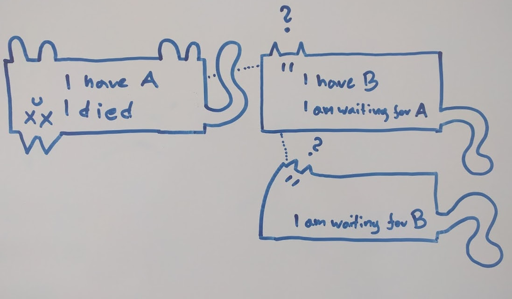
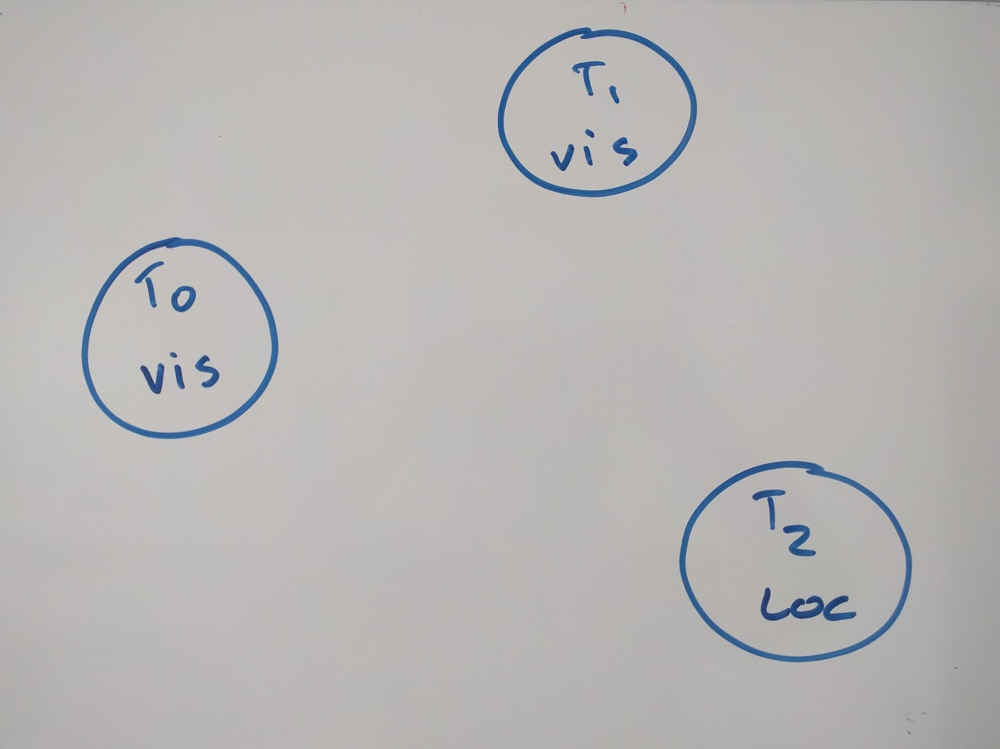
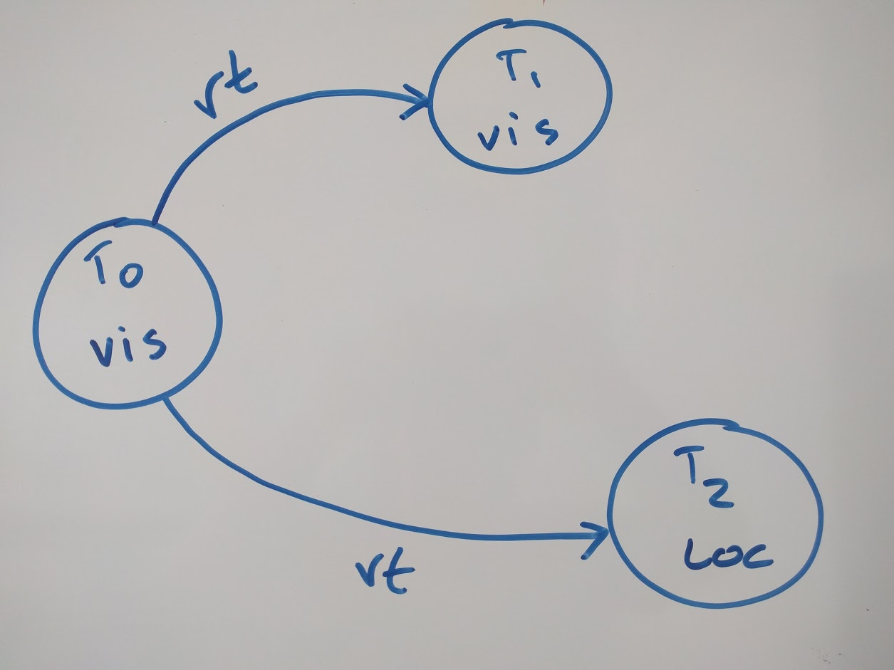

Konrad does transactions
========================================================
author: 
date: 13 II 2018
autosize: true

Start
========================================================

- Concurrency primer
- Serializability
- Opacity
- Proving opacity

Concurrency primer
========================================================
type:sub-section


Concurrency
========================================================
incremental:true

Given a happens-before relation →,  P and Q s.t. P ≠ Q are **concurrent** iff and P ↛ Q and Q ↛ P. 

**Shared memory** is memory that may be simultaneously accessed by multiple programs.

<!--``` {java}
interface Stack {
  boolean isEmpty();
  Object pop();
  push(Object obj);
}
```-->


```java
move(Stack a, Stack b) {
  if (!a.isEmpty()) {
    obj = a.pop();
    b.push(obj);
  }
}
```

<!-- (new Thread() { void run() { move(a, b); }}).start();
move(a, b); -->


```
[θ1] move(a,b)       ‖  [θ2] move(a,b)
a.isEmpty() → false  ‖  a.isEmpty() → false
a.pop() → x          ‖
                     ‖  a.pop() → y
                     ‖  b.push(y)
b.push(x)            ‖           
``` 

Concurrency is difficult
========================================================

**Race condition**

```
[θ1] move(a,b)       ‖  [θ2] move(a,b)
a.isEmpty() → false  ‖  a.isEmpty() → false
a.pop() → x          ‖
                     ‖  a.pop() → y
                     ‖  b.push(...)
b.push(...)          ‖           
``` 

Initial state: `a=[x, y], b=[]`  
Expected final state: `a[], b=[y, x]`  
Actual final state: `a[], b=[x, y]`

Concurrency is difficult
========================================================

**Race condition (2)**

```
[θ1] move(a,b)       ‖  [θ2] move(a,b)
a.isEmpty() → false  ‖  a.isEmpty() → false
a.pop() → x          ‖
                     ‖  a.pop() → waskjhdfghgasak     
``` 

Initial state: `a=[x], b=[]`  
Expected final state: `a=[], b=[x]`  
Actual final state: `waskjhdfghgasak`

Synchronization
========================================================

**Global lock**


```java
move(Stack a, Stack b) {
  globalLock.lock();
  if (a.isEmpty()) {
    obj = a.pop();
    b.push(obj);
  } 
  globalLock.unlock();  
}
```

Synchronization
========================================================

**Fine grained locking**


```java
move(Stack a, Stack b) {
  locks[a].lock();
  locks[b].lock();
  if (a.isEmpty()) {
    obj = a.pop();
    locks[a].unlock();
    b.push(obj);
  } else 
    locks[a].unlock();
  locks[b].unlock();  
}
```

Concurrency is difficult
========================================================

**Deadlock**


```
move(a, b) ‖ move(b, a)
```

Concurrency is difficult
========================================================

**Convoying**


Concurrency is difficult
========================================================

**Convoying**



Concurrency is difficult
========================================================

**Priority inversion**  
**Resource starvation**  
**Livelocks**  
**Thundering herd problem**  

Transactional memory
========================================================
type:sub-section

Transactional memory
========================================================

<!-- 
Remove deadlocks, convoying, and priority inversions
Serializability, atomicity, one transaction at a time per process
-->

Maurice Herlihy and J. Elliot B. Moss.
**Transactional memory: architectural support for lock-free data structures**.
ISCA '93.  

Nir Shavit, Dan Touitou.
**Software transactional memory**.  
PODC '95.

- Transactions execute **speculatively**: writes to memory are tentative and only made visible to other transactions.
- A commit operation allows a transaction to make its writes visible, but 
- A commit is succesful only if no other transaction has updated or read the same memory locations as this transaction (no **conflicts**); otherwise
- An abort operation discards all tentative updates and the transaction is meant to re-start from scratch.
- Precludes: **deadlocks**, **convoying**, **priority inversion** (potentially introduces **livelocks**).

Example
========================================================


```java
move(Stack a, Stack b) {
  transaction.start();
  if (a.isEmpty()) {
    obj = a.pop();
    b.push(obj);
  } 
  transaction.commit();
}
```

Example execution
========================================================

```
[θ1] move(a,b)       ‖  [θ2] move(a,b)
a.isEmpty() → false  ‖  a.isEmpty() → false
a.pop() → x          ‖
                     ‖  a.pop() → x
                     ‖  b.push(x)
b.push(x)            ‖  
commit → ok          ‖  commit → abort!
                     ‖  a.isEmpty() → false
                     ‖  a.pop() → y
                     ‖  b.push(y) 
                     ‖  a.pop() → y
                     ‖  commit → ok
``` 

Is this execution correct?
========================================================

```
[θ1] move(a,b)       ‖  [θ2] move(a,b)
a.isEmpty() → false  ‖  a.isEmpty() → false
a.pop() → x          ‖
                     ‖  a.pop() → x
                     ‖  b.push(x) 
b.push(x)            ‖  
commit → ok          ‖  commit → abort!
                     ‖  a.isEmpty() → false
                     ‖  a.pop() → y
                     ‖  b.push(y) 
                     ‖  a.pop() → y
                     ‖  commit → ok
``` 

Initial state: `a=[x, y], b=[]`  
Expected final state: `a=[], b=[y, x]`  
Actual final state: `a=[], b=[y, x]`

What is a correct execution?
========================================================
type:sub-section

Serializability/global atomicity
========================================================

Christos H. Papadimitrou. **The serializability of concurrent database updates**. JACM 1979. 

"A sequence of atomic user updates/retrievals is called serializable essentially 
if its overall effect is as though the users took turns, 
in some order, each executing their entire transaction indivislbly."

History $H$ is serializable iff there exists some **sequential** history $S$ **equivalent** to a **completion** $\textit{Compl(H)}$ s.t. any committed transaction $T_i \in S$ **is legal in** $S$.

Some notation
========================================================

**Histories**

$$ 
\small
H = \langle 
\textit{inv}_1(\texttt{a}, \texttt{isEmpty}, \bot), 
\textit{ret}_1(\texttt{a}, \texttt{isEmpty}, \texttt{false}), 

\textit{inv}_2(\texttt{a}, \texttt{isEmpty}, \bot), \\\small
\textit{ret}_2(\texttt{a}, \texttt{isEmpty}, \texttt{false}), 

\textit{inv}_1(\texttt{a}, \texttt{pop}, \bot), 
\textit{ret}_1(\texttt{a}, \texttt{pop}, \texttt{x}), \\\small

\textit{inv}_2(\texttt{a}, \texttt{pop}, \bot), 
\textit{ret}_2(\texttt{a}, \texttt{pop}, \texttt{x}), 

\textit{inv}_2(\texttt{b}, \texttt{push}, \texttt{x}), 
\textit{ret}_2(\texttt{b}, \texttt{push}, \bot), \\\small

\textit{inv}_1(\texttt{b}, \texttt{push}, \texttt{x}), 
\textit{ret}_1(\texttt{b}, \texttt{push}, \bot), 

\textit{inv}_1(T_1, \textit{tryC}, \bot), \\\small
\textit{ret}_1(T_1, \textit{tryC}, \textit{C}), 

\textit{inv}_2(T_2, \textit{tryC}, \bot), 
\textit{ret}_2(T_2, \textit{tryC}, \textit{A}), ... 
\rangle
$$

**Transactions**

$$
\small
H|T_1 = \langle 
\textit{inv}_1(\texttt{a}, \texttt{isEmpty}, \bot), 
\textit{ret}_1(\texttt{a}, \texttt{isEmpty}, \texttt{false}), 
\textit{inv}_1(\texttt{a}, \texttt{pop}, \bot), \\\small
\textit{ret}_1(\texttt{a}, \texttt{pop}, \texttt{x}), 
\textit{inv}_1(\texttt{b}, \texttt{push}, \texttt{x}), 
\textit{ret}_1(\texttt{b}, \texttt{push}, \bot), \\\small
\textit{inv}_1(T_1, \textit{tryC}, \bot), 
\textit{ret}_1(T_1, \textit{tryC}, \textit{C}) 
\rangle
$$

Same but shorter
========================================================

**Histories**

$$
\small
H = \langle 
\textit{exec}_1(\texttt{a}, \texttt{isEmpty}, \bot, \texttt{false}), 
\textit{exec}_2(\texttt{a}, \texttt{isEmpty}, \bot, \texttt{false}), \\\small

\textit{exec}_1(\texttt{a}, \texttt{pop}, \bot, \texttt{x}), 
\textit{exec}_2(\texttt{a}, \texttt{pop}, \bot, \texttt{x}), \\\small

\textit{exec}_2(\texttt{b}, \texttt{push}, \texttt{x}, \bot), 
\textit{exec}_1(\texttt{b}, \texttt{push}, \texttt{x}, \bot), \\\small

\textit{exec}_1(T_1, \textit{tryC}, \bot, \textit{C}),
\textit{exec}_2(T_2, \textit{tryC}, \bot, \textit{A}), ... 
\rangle
$$

**Transactions**

$$
\small
H|T_1 = \langle 
\textit{exec}_1(\texttt{a}, \texttt{isEmpty}, \bot, \texttt{false}), \\\small
\textit{exec}_1(\texttt{a}, \texttt{pop}, \bot, \texttt{x}), 
\textit{exec}_1(\texttt{b}, \texttt{push}, \texttt{x}, \bot), \\\small
\textit{exec}_1(T_1, \textit{tryC}, \bot, \textit{C})
\rangle
$$

And even shorter
========================================================

**Histories**

$$
\small
H = \langle 
\texttt{isEmpty}_1(\texttt{a}, \texttt{false}), 
\texttt{isEmpty}_2 (\texttt{a}, \texttt{false}), 

\texttt{pop}_1(\texttt{a}, \texttt{x}), 
\texttt{pop}_2(\texttt{a}, \texttt{x}), \\\small

\texttt{push}_2(\texttt{b}, \texttt{x}), 
\texttt{push}_1(\texttt{b}, \texttt{x}), 

\textit{tryC}_1, \textit{C}_1,
\textit{tryC}_2, \textit{A}_2, ... 
\rangle
$$

**Transactions**

$$
\small
H|T_1 = \langle 
\texttt{isEmpty}_1(\texttt{a}, \texttt{false}), 
\texttt{pop}_1(\texttt{a}, \texttt{x}), 
\texttt{push}_1(\texttt{b}, \texttt{x}), 
\textit{tryC}_1, \textit{C}_1,
\rangle
$$

Sequential and equivalent histories
========================================================

$$
\small
H = \langle 
\texttt{isEmpty}_1(\texttt{a}, \texttt{false}), 
\texttt{isEmpty}_2 (\texttt{a}, \texttt{false}), 

\texttt{pop}_1(\texttt{a}, \texttt{x}), 
\texttt{pop}_2(\texttt{a}, \texttt{x}), \\\small

\texttt{push}_2(\texttt{b}, \texttt{x}), 
\texttt{push}_1(\texttt{b}, \texttt{x}), 

\textit{tryC}_1, \textit{C}_1,
\textit{tryC}_2, \textit{A}_2, ... 
\rangle
$$

$$
\small
S = \langle 
\texttt{isEmpty}_1(\texttt{a}, \texttt{false}), 
\texttt{pop}_1(\texttt{a}, \texttt{x}), 
\texttt{push}_1(\texttt{b}, \texttt{x}), 
\textit{tryC}_1, \textit{C}_1, \\\small
\;\;\;\;\;\;
\texttt{isEmpty}_2 (\texttt{a}, \texttt{false}), 
\texttt{pop}_2(\texttt{a}, \texttt{x}), 
\texttt{push}_2(\texttt{b}, \texttt{x}), 
\textit{tryC}_2, \textit{A}_2, ... 
\rangle
$$

$S$ is **sequential**  
$S$ is **equivalent** to $H$

Completion
========================================================

$$
\small
H = \langle 
\texttt{isEmpty}_1(\texttt{a}, \texttt{false}), 
\texttt{isEmpty}_2 (\texttt{a}, \texttt{false}), 

\texttt{pop}_1(\texttt{a}, \texttt{x}), 
\texttt{pop}_2(\texttt{a}, \texttt{x}), \\\small

\texttt{push}_2(\texttt{b}, \texttt{x}), 
\texttt{push}_1(\texttt{b}, \texttt{x}), 

\textit{tryC}_1 
\rangle
$$

$$
\small
H_c = \langle 
\texttt{isEmpty}_1(\texttt{a}, \texttt{false}), 
\texttt{isEmpty}_2 (\texttt{a}, \texttt{false}), 

\texttt{pop}_1(\texttt{a}, \texttt{x}), 
\texttt{pop}_2(\texttt{a}, \texttt{x}), \\\small

\texttt{push}_2(\texttt{b}, \texttt{x}), 
\texttt{push}_1(\texttt{b}, \texttt{x}), 

\textit{tryC}_1,  \textit{C}_1,
\textit{tryA}_2, \textit{A}_2
\rangle
$$

$T_1$ and $T_2$ are **not complete** in $H$.  
$T_1$ and $T_2$ are **complete** in $H_c$.
$H_c$ is a **completion** of $H$.  

Legality
========================================================

Semantics of shared objects are descibed by a **sequential specifications**. $\textit{Seq}(\texttt{obj})$ is a prefix-closed set that contains all correct sequences of operations that can be performed on $\texttt{obj}$.

$$
\small \textit{Seq}(\texttt{a}) = \{  
  %\langle \texttt{isEmpty}_i(\texttt{a}, \texttt{false}), \texttt{pop}_j(\texttt{a}, \texttt{x}) \rangle, 
  \langle \texttt{isEmpty}_i(\texttt{a}, \texttt{false}), \texttt{pop}_j(\texttt{a}, \texttt{x}), \texttt{isEmpty}_i, \texttt{pop}_k(\texttt{a}, \texttt{y}) \rangle, \\\small
  \langle \texttt{push}_i(\texttt{a}, \textit{X}), \texttt{push}_j(\texttt{a}, \textit{Y}) \rangle, 
  %\langle \texttt{push}_i(\texttt{a}, \textit{X}), \texttt{pop}_j(\texttt{a}, \textit{X}) \rangle, 
  ... \}
$$

$$ 
\small
S|\texttt{a} = \langle 
\texttt{isEmpty}_1(\texttt{a}, \texttt{false}), 
\texttt{isEmpty}_2 (\texttt{a}, \texttt{false}), 
\texttt{pop}_1(\texttt{a}, \texttt{x}), 
\texttt{pop}_2(\texttt{a}, \texttt{x})
\rangle
$$

$H$ is **legal** if for every object $\texttt{obj}$ it is true that $H|\texttt{obj} \in \textit{Seq}(\texttt{obj})$.  

$T_i$ is **legal** in $H$ if a history $H'$ created by removing all aborted transactions from $H$ except $T_i$ is legal.

Serializability/global atomicity
========================================================

Christos H. Papadimitrou. **The serializability of concurrent database updates**. JACM 1979.  

W. E. Weihl. **Local atomicity properties: modular concurrency control for abstract
data types.** TOPLAS 1989.

"A sequence of atomic user updates/retrievals is called serializable essentially 
if its overall effect is as though the users took turns, 
in some order, each executing their entire transaction indivislbly."

History $H$ is serializable iff there exists some **sequential** history $S$ 
**equivalent** to a **completion** $\textit{Compl(H)}$ s.t. 
any committed transaction $T_i \in S$ **is legal in** $S$.

Is this execution correct?
========================================================

```
[θ1] move(a,b)       ‖  [θ2] move(a,b)
a.isEmpty() → false  ‖  a.isEmpty() → false
a.pop() → x          ‖
                     ‖  a.pop() → x
                     ‖  b.push(x) 
b.push(x)            ‖  
commit → ok          ‖  commit → abort!
                     ‖  a.isEmpty() → false
                     ‖  a.pop() → y
                     ‖  b.push(y) 
                     ‖  a.pop() → y
                     ‖  commit → ok
```

**Serializable**:  
There exists $S = H|T_1 \cdot H|T_2 \cdot H|T_3$ equivalent to the completion of $H$ in which $T_1$ and $T_3$ are legal in $S$.  
$T_2$ is illegal in $S$, but it is aborted, so it doesn't matter.

Problems with serializability in TM
========================================================


```java
transaction.start();
x.write(2); y.write(4);
transaction.commit();
```


```java
transaction.start();
vx = x.read(); vy = y.read();
for (; vx != vy; vx++) {
  array[vx] = 0;
} 
transaction.commit();
```

```
[θ1]                 ‖  [θ2]
x.write(2)           ‖  
                     ‖  x.read() → 2  
                     ‖  y.read() → 0
y.write(4)           ‖  
commit → ok          ‖
```

Is this execution correct?
========================================================

```
[θ1]                 ‖  [θ2]
x.write(2)           ‖  
                     ‖  x.read() → 2  
                     ‖  y.read() → 0
y.write(4)           ‖  
commit → ok          ‖
```
**Serializable**:  
There exists $S = H|T_1 \cdot H|T_2$ equivalent to the completion of $H$ in which $T_1$ is legal in $S$.  
$T_2$ is illegal in $S$, but it is aborted, so it doesn't matter.

**ArrayOutOfBoundsException** (or worse).

Other correcteness criteria
========================================================

**Linearizability** ✗  
**1-copy serializability** ✗    
**Global atomicity** ✗  
**Recoverability** ✗  
**Rigorousness**  -- too strong

A correctness criterion for TM
=======================================================
type:sub-section

Opacity
========================================================

Rachid Guerraoui, Michał Kapałka. On the correctness of transactional memory.  PPoPP '08.

"At first approximation, opacity can be viewed be viewed as an extension of serializability with the additional requirement that even non-comitted transactions are prevented from accessing inconsistent states."

History $H$ is opaque iff there exists some **sequential** history $S$ **equivalent** to a **completion** $\textit{Compl(H)}$ s.t. 
- $S$ preserves the **real-time order** of $H$, and
- any transaction $T_i \in S$ **is legal in** $S$.

Is this execution correct?
========================================================

```
[θ1]                 ‖  [θ2]
x.write(2)           ‖  
                     ‖  x.read() → 2  
                     ‖  y.read() → 0
y.write(4)           ‖  
commit → ok          ‖
```
**Not opaque**:  
Either $S = H|T_1 \cdot H|T_2$ or $S = H|T_2 \cdot H|T_1$.  
In either case $T_1$ is legal in $S$.  
In either case $T_2$ is illegal in $S$.

Real-time order
========================================================

$T_i \prec_H T_j$ if $T_i$ is complete and the last event of T_i in $H$ precedes in $H$ the first event of $T_j$ in $H$.

$S$ preserves the real-time order of $H$ if for all transactions $T_i$ and $T_j$ in $H$, if $T_i \prec_H T_j$.

Real-time order requirement
========================================================

<!--&#8291;-->


```java
thread {                thread {
  tr1.start();            tr2.start();
  x = 42;                 tmp = x;
  tr1.abort();            tr2.commit();
}                         tr3.start();
                          x = tmp;
                          tr3.commit();
                        }
```

```
[θ1]                 ‖  [θ2]
x.write(42)          ‖  x.read() → 42  
abort                ‖  commit → ok 
                     ‖  x.write(42)
                     ‖  commit → ok 
```

**Serializable:**
$S = H|T_3 \cdot H|T_2 \cdot H|T_1$ is equivalent to $H$.  
$T_1$, $T_2$, and $T_3$ are legal in $S$.  
**Not opaque:** $S$ does not preserve real-time order of $H$.

Prefix-closeness
========================================================

Opacity is not **prefix-closed**.

```
[θ1] move(a,b)       ‖  [θ2] move(a,b)
x.write(1)           ‖  x.read → 1
commit → ok          ‖  commit → ok
```

$$ 
\small
H = \langle 
\textit{inv}_1(\texttt{x}, \texttt{write}, 1), 
\textit{inv}_2(\texttt{x}, \texttt{read}, \bot), 
\textit{ret}_2(\texttt{x}, \texttt{read}, 1), 
\textit{ret}_1(\texttt{x}, \texttt{write}, \bot), \\\small
\textit{inv}_1(T_1, \textit{tryC}, \bot), 
\textit{ret}_1(T_1, \textit{tryC}, \textit{C}), 
\textit{inv}_2(T_2, \textit{tryC}, \bot), 
\textit{ret}_2(T_2, \textit{tryC}, \textit{C})
\rangle
$$

**Opaque**:  
$S = H|T_1 \cdot H|T_2$ is equivalent to $H$.  
$T_1$ and $T_2$ are legal in $S$.

Prefix-closeness (2)
========================================================

Opacity is not **prefix-closed**.

```
[θ1] move(a,b)       ‖  [θ2] move(a,b)
x.write() → 1        ‖  x.read → 1
commit → ok          ‖  commit → ok
```

$$ 
\small
H_p = \langle 
\textit{inv}_1(\texttt{x}, \texttt{write}, 1), 
\textit{inv}_2(\texttt{x}, \texttt{read}, \bot), 
\textit{ret}_2(\texttt{x}, \texttt{read}, 1),
\textit{ret}_1(\texttt{x}, \texttt{write}, \bot)
\rangle
$$

**Not opaque**:  
Complete $H_p$ by aborting both transactions.  
$S = H_p|T_1 \cdot H_p|T_2$ is equivalent to completion of $H$.  
$T_2$ is not legal in $S$.

Safety property
========================================================

Safety properties are properties which guarantee that “something [bad] will not happen."

A property $p$ is a **safety property** if, given the set $P$ of all histories that satisfy p:

- **Prefix-closure**: every prefix $H'$ of a history $H \in P$ is also in $P$,
- **Limit-closure**: for any infinite sequence of finite histories: $H_0, .. H_1, ...$ s.t. for every $i=0,1,..$ $H_i \in P$ and $H_i$ is a prefix of $H_{i+1}$, the infinite history that is the limit of the sequence is also in $P$.

Opacity: take 2
========================================================

Rachid Guerraoui, Michał Kapałka. Principles of transactional memory. 2010.

History $H$ is **final-state opaque** iff there exists some **sequential** history $S$ **equivalent** to a **completion** $\textit{Compl(H)}$ s.t. 
- $S$ preserves the **real-time order** of $H$, and
- any transaction $T_i \in S$ **is legal in** $S$.

History $H$ is **opaque** iff every finite prefix of H is **final-state opaque**.

There's still plenty wrong with opacity
========================================================

Hagit Attiya, Sandeep Hans, Petr Kuznetsov, Srivatsan Ravi. **Safety of deferred update in transactional memory**. DISC '13.

"We observe that opacity does not preclude
scenarios in which a transaction reads from a future
transaction."  
"We show that
extending opacity to infinite histories in a non-trivial way, does not result in a limit-closed
property."  

Mohsen Lesani, Jens Palsberg. **Decomposing opacity.** DISC '14.

"Verifying a complicated monolithic condition for a realistic specification of a TM algorithm can be a formidable problem."

**OUT OF SCOPE OF THIS PRESENTATION**

Proving opacity
========================================================

Let $H$ be any history with **unique writes**, Let $V_{\ll}$ be any **version order function** in $H$. Denote $V_\ll(x)$ as $\ll_x$. We define the $G = \textit{OPG}(H, V_\ll)$ to be the directed, labelled graph constructed in the following way:

For every $T_i \in H$ there is a vertex $T_i$ in $G$. Vertes $T_i$ is labelled $\textit{vis}$ if $T_i$ is comitted or if some transaction **reads from** $T_i$ in $H$, otherwise it is labelled $\textit{loc}$.

For all vertices $T_i$ and $T_k$ in $G$, $i\neq k$, there is an edge from $T_i$ to $T_k$ in any of the following cases:  

Proving opacity (cont'd)
========================================================


- If $T_i$ **precedes** $T_k$ in $H$, then the edge is labelled $\textit{rt}$ (real-time);
- If $T_k$ **reads from** $T_i$ in $H$, then the edge is labelled $\textit{rf}$;
- If, for some variable $x$, $T_i \ll_x T_k$ in $H$, then the edge is labelled $\textit{ww}$ (write after write);
- If vertex $T_k$ is labelled $\textit{vis}$ and there is a $T_m \in H$ and a variable $x$ s.t. $T_m \ll_x T_k$ and $T_i$ reads form $T_m$ in $H$, the edge is labelled $\textit{rw}$ (read before write).
 
Is this execution correct?
========================================================

```
[θ1]                 ‖  [θ2]
x.write(2)           ‖  
                     ‖  x.read() → 2  
                     ‖  y.read() → 0
y.write(4)           ‖  
commit → ok          ‖
```

Is this execution correct?
========================================================



Is this execution correct?
========================================================



Is this execution correct?
========================================================


Is this execution correct?
========================================================


Is this execution correct?
========================================================


Commit
========================================================

- **Concurrency is difficult**.
- TM is an approach that's supposed to make concurrent programming **easier**.
- Properties define whether a concurrent execution is **correct or incorrect**.
- DB properties like serializability **don't work** for general-purpose programming.
- **Opacity** precludes the problem of **inconsistent views**.
- Being a **safety property** is important.
- New opacity also **sucks** (out of scope).
- It's hard to reason about concurrent executions.
