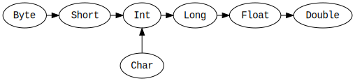

```{r setup, include=FALSE}
knitr::opts_chunk$set(echo = FALSE)
```

## Course information

**BIE-OOP**  
Object Oriented Programming  

**Course website**: https://courses.fit.cvut.cz/BI-OOP/

## Contact information

<div style="float: left; width: 75%;">
**Ing. Konrad Siek, PhD.**  
Programming Research Lab  
Faculty of Information Technology

**Office**: Thákurova 7, A-1252  
**Email**: siekkonr@fit.cvut.cz  
**My website**: https://kondziu.github.io/  

**Office hours**: Wednesdays 10:00-11:00

</div>
<div style="float: right; width: 25%;">

{width=200px, height=200px}

</div>

## What is Scala?

> Scala combines **object-oriented** and **functional programming** in one **concise**, **high-level** language. Scala's **static types** help avoid bugs in complex applications, and its **JVM** and **JavaScript** runtimes let you build **high-performance** systems with easy access to huge **ecosystems of libraries**.

[**scala-lang.org**](https://www.scala-lang.org)

## What is Scala?

Scala is a modern **multi-paradigm programming language** designed to express common programming patterns in a **concise**, **elegant**, and **type-safe way**. It smoothly integrates features of **object-oriented** and **functional languages**.

[**Tour of Scala**](https://docs.scala-lang.org/tour/tour-of-scala.html).

## What is Scala?

2003 - A drunken **Martin Odersky** sees a Reese's Peanut Butter Cup ad featuring somebody's peanut butter getting on somebody else's chocolate and has an idea. He creates Scala, a language that **unifies constructs** from both **object oriented** and **functional languages**. This pisses off both groups and each promptly declares jihad.

James Iry. [**A Brief, Incomplete, and Mostly Wrong History of Programming Languages**](http://james-iry.blogspot.com/2009/05/brief-incomplete-and-mostly-wrong.html). 2009.

## What is Scala?

{width=500px}

Hieronymus Bosch. [**A visual guide to the Scala language**](https://classicprogrammerpaintings.com/post/142321815809/hieronymus-bosch-a-visual-guide-to-the-scala). Oil on oak panels, 1490-1510.

 The left panel shows the **functional features**, the main one describes the **type system**, and the right the **object oriented parts**.

## Expressions

<div style="float: left; width: 40%;">

```scala
2 + 3
2 - 3 
2 * 3
2 / 3
2 % 3

2 ^ 3
2 & 3
2 | 3

2 >> 3
2 << 3
```

</div>
<div style="float: right; width: 50%;">

```scala
"ahoj"
"ahoj" + 2
"ahoj" * 2

"ahoj" + " " + "světe!"
```

```scala
1 == 2
1 >= 2
1 <= 2
```

```scala
"a" -> 2
```

</div>

## Values

```scala
val x = 5
val s = "spaceship"
val y : Int = 0
```

## Variables

```scala
var vx = 5
var vs = "spaceship"
var vy : Int = 0
```

```scala
x = 42
vx = 42
```

## Default values

```scala
var x : Int = _
var s : String = _
```

## Everything is an object

```scala
5.toString()
```

## Operators are methods

```scala
val x, y = 2

x + y
x.+(y)
```

## Infix notation

```scala
val s = "something something spaceship"
s.split(" ")
s split(" ")
s split " "
```

Only use with **arity 1 pure functions**. Strongly encouraged if the argument is a function. 

([Scala style guide](http://docs.scala-lang.org/style/method-invocation.html))

## Omitting parentheses

```scala
val x = 2
x.toString()
x.toString
x toString
```

Only use with **arity 0 pure functions**.

([Scala style guide](http://docs.scala-lang.org/style/method-invocation.html))

## Unified types

{width=800px}

## Casting

```scala
val i:Int = 1
val d:Double = i
```

```scala
val d:Double = 1.0d
val i:Int = d
```

## Casting order



## Explicit casting

```scala
0.asInstanceOf[Char]
1.asInstanceOf[Double]
2.asInstanceOf[Float]
'a'.asInstanceOf[Int]
```

## Tupples

```scala
val x = (1, "B")
val y = ("A", 2, 3)
```

```scala
val a, b = x

a == x._1
b == x._2
```

```scala
1 -> "B"
```

## Functions (lambdas)

```scala
(x: Int) => x + 1
```

```scala
val addOne = (x: Int) => x + 1
val ahoj = () => "ahoj"
val ahoj = () => println("ahoj")
```

## Functions (lambdas)

```scala
(x: Int) => x + 1
```

```scala
val addOne = (x: Int) => x + 1
val ahoj: () => String = () => "ahoj"
val ahoj: () => Unit = () => println("ahoj")
```

## Function arguments

```scala
val sumZero = () => 0
val sumOne = (x:Int) => x
val sumTwo = (x:Int, y:Int) => x + y
val sumThree = (x:Int, y:Int, z:Int) => x + y + z
/* ... */
val sumTwentyTwo = (a:Int, b:Int, c:Int, d:Int, e:Int, f:Int, 
                    g:Int, h:Int, i:Int, j:Int, k:Int, l:Int, 
                    m:Int, n:Int, o:Int, p:Int, q:Int, r:Int, 
                    s:Int, t:Int, u:Int, v:Int) => 
                    a + b + c + d + e + f + g + h + i + j + 
                    k + l + m + n + o + p + q + r + s + t + 
                    u + v
```

## Functions are objects

```scala
val f = (x: Int) => x + 1

f.apply(1)
f.toString()
```

## Blocks

```scala
{ 2 + 2 }
{ val x = 2; x }
{ val x = 2; val y = 2; x + y }
{ println("x") }
```

```scala
val xy = { 
  val x = 2
  val y = 2
  x + y
}
```

```scala
val f: (Int, Int) => String = (n:Int, d:Int) => 
  { val w = n / d; val m = n % d; w + " * " + d + " + " + m }
```

## Methods

```scala
def addOne(x: Int): Int = {
    return x + 1
}
```

## Methods (syntax variants)

```scala
def addOne(x: Int): Int = {
    return x + 1
}
```

```scala
def addOne(x: Int) = {
    x + 1
}
```

```scala
def addOne(x: Int) {x + 1}       // → unit, deprecated!
```

```scala
def addOne(x: Int) = x + 1
```

## Default arguments

```scala
def add(x: Int, y: Int = 1) = { x + y }

add(1, 1)
add(1)
```

## Argument groups

```scala
def add(x: Int)(y: Int) = { x + y }

add(1)(1)
val addOne = add(1)
```

## Nested methods

```scala
def outer(x: Int) = {
    def inner(y: Int) = {
        y + x
    }
    inner(x)
}
```

## Method to function conversion

```scala
def addOne(x: Int) = {x + 1}
val f = addOne _             // η-conversion

f.apply(1)
f.toString()
```

```scala
val fs = "s".toString _
fs()
```

## Implicit conversion

```scala
def addOne(x: Int) = {x + 1}

addOne.apply(1)
addOne.toString()
```

```scala
val x = addOne
x(1)
x.apply(1)
x.toString()
```

## Classes

```scala
class Enterprise() {}
```

## Classes

```scala
class Enterprise() {                        // primary constructor
    val version = "NCC-1701"
    val captain = "Kirk, J. T."

    val maxShields = 100
    var shieldDmg = 0

    def shieldLvl() = {maxShields - shieldDmg}

    println("Split all the infinitives!")
}

val enterprise = new Enterprise()
```

## Member visibility

- global visibility by default
- `private`
- `private[package]`
- `private[this]`
- `protected`
- `protected[package]`
- `protected[this]`

## Private visibility

```scala
class Spaceship {
  private val name = "USS Enterprise"

  def compare (e: Spaceship): Boolean = e.name == this.name
}
```

vs

```scala
class Spaceship {
  private[this] val name = "USS Enterprise"

  def compare (e: Spaceship): Boolean = e.name == this.name
}
```

```
error: value name is not a member of Spaceship
def compare (e: Spaceship): Boolean = e.name == this.name
```

## Constructor arguments

```scala
class Enterprise(ver: String, capt: String) {
    val version = ver
    val captain = capt

    val maxShields = 100
    var shieldDmg = 0

    def shieldLvl() = {maxShields - shieldDmg}
}

val enterprise = new Enterprise("NCC-1701", "Kirk, J. T.")
enterprise.shieldDmg = 10
enterprise.shieldLvl()
enterprise.shieldLvl
```

## Additional constructor definition

```scala
class Enterprise(ver: String, capt: String) {
    def this() = {
        this("NCC-1701", "Kirk, J. T.")   // 1st expression in method
    }
}
```

## Parameterless methods / lazy fields

```scala
class Enterprise(ver: String, capt: String) {
    def version = ver
    def captain = capt

    val maxShields = 100
    var shieldDmg = 0

    def shieldLvl = {maxShields - shieldDmg}
}

val enterprise = new Enterprise("NCC-1701", "Kirk, J. T.")
enterprise.shieldDmg = 10
enterprise.shieldLvl
```

## Inheritence and overloading

```scala
abstract class Constitution() { // extends AnyRef
    def shipClass = "Constitution"
    def shipName = {}
}

class Enterprise(ver: String, capt: String) extends Constitution {
    override def shipName = "Enterprise"
}
```

## Overloading variables

```scala
abstract class Constitution() { // extends AnyRef
    var shipClass = "Constitution"
    def shipName = {}
}

class Enterprise(ver: String, capt: String) extends Constitution {
    override var shipClass = "Enterprise"
}
```

```
error: overriding variable shipClass in class Constitution 
of type java.lang.String;
variable shipClass cannot override a mutable variable
           override var shipClass = "Enterprise"
```

## Operator overloading

```scala
class C {
    def < (that: Any): Boolean = {
        // ...
    }
}
```

## Static object

```scala
object universe {
    val age: Long = 45L
    def getBlackHoles() = {
        // ...
    }
}
```

## Companion objects

```scala
class Shipyard {
  def makeShip = ???
}

object Shipyard {
  def makeShipyard = ???
  def getAllShipyards = ???
}
```

## "main"

```scala
object Something extends App {
   // Code goes here.
}
```

## Generic classes

```scala
class RefCell[T] {
    private var obj: T = _
    def get: T = { obj }
    def set(value: T) = { obj = value }
}

val s = new RefCell[String]
s set "HelloWorld"
s get

val x = new RefCell[Int]
x set 5
x get
```

# Traits

```scala
trait WarpSpeedCapability
```

## Traits with members

```scala
trait WarpSpeedCapability {
    def setCruisingSpeed
    def setMaximumWarp
}
```

## Traits with defined members

```scala
trait WarpSpeedCapability {
    var currentSpeed = 0.
    def setCruisingSpeed = { currentSpeed = 2. }
    def setMaximumWarp = { currentSpeed = 9. }
}
```

## Trait usage

```scala
class Enterprise(ver: String, capt: String) 
extends Constitution with WarpSpeedCapability {
    override def shipName = "Enterprise"
}
```

## Mulitple traits

```scala
trait AuxiliaryCraft {
    var isAwayTeamSent = false
    def sendAwayTeam = {
        // ...
    }
}

class Enterprise(ver: String, capt: String) 
extends Constitution with WarpSpeedCapability with AuxiliaryCraft {
    override def shipName = "Enterprise"
}
```

## Conflicting traits

```scala
trait AuxiliaryCraft {
    val awayTeamType = "shuttlecraft"
    def sendAwayTeam = {
        // ...
    }
}

trait Transporter {
    val awayTeamType = "transporter"
    def sendAwayTeam = {
        // ...
    }
}
```

## Conflicting traits

```scala
class Enterprise(ver: String, capt: String, maxShld: Int) 
extends Constitution with WarpSpeedCapability 
                     with AuxiliaryCraft 
                     with Transporter {
                     
    override def awayTeamType = "transporter or shuttlecraft"
    override def sendAwayTeam = {
        // ...
    }
}
```


## Irresolvably conflicting traits

```scala
trait AuxiliaryCraft {
    var isAwayTeamSent = false
    def sendAwayTeam = {
        // ...
    }
}

trait Transporter {
    var isAwayTeamSent = false
    def sendAwayTeam = {
        // ...
    }
}
```

## Irresolvably conflicting traits

```scala
class Enterprise(ver: String, capt: String, maxShld: Int) 
extends Constitution with WarpSpeedCapability 
                     with AuxiliaryCraft 
                     with Transporter {
                     
    override def sendAwayTeam = {
        // ...
    }
}
```

```
error: class Enterprise inherits conflicting members:
  variable isAwayTeamSent in class AuxiliaryCraft$class of type Boolean and
  variable isAwayTeamSent in class Transporter$class of type Boolean
(Note: this can be resolved by declaring an override in class Enterprise.);
 other members with override errors are: isAwayTeamSent_=
```
 
# Collections
 
## Mutability
 
- Immutable
  
    - lists
    - ranges
    - sets
    - maps
    
- Mutable

    - tables
    - sets
    - maps
    - queues and stacks

## Lists

```scala
val c = List(1, 2, 3, 4)
val c = 1 :: 2 :: 3 :: 4 :: Nil
val c = List(1, 2) ::: List(3, 4)

c(0)

c head
c tail
c last
c isEmpty
c length

c reverse
c iterator

c slice (0, 2)
```

## Sets

```scala
val s = Set(1, 2, 3, 4, 4)

s(1)
s contains 1

s - 1
s + 5
s + (6,7)
s empty

val a = Set(1, 2, 3, 4)
val b = Set(3, 4, 5, 6)

a union b       // union
a | b           // union
a ++ b          // union

a subsetOf b

a intersect b   // intersection
a & b           // intersection

a diff b        // difference
a &~ b          // difference
a -- b          // difference
```

## Ranges

```scala
val r = Range(0, 10)

r(0)

val r = 1.to(10)
val r = 1.until(10)

val r = 1 to 10
val r = 1 until 10

r reverse
r iterator
```

## Maps

<div style="float: left; width: 50%;">

```scala
val m = Map("a" -> 1, "b" -> 2)
val m = Map(("a", 1), ("b", 2))

m("a")
m get "a"

m get "x"
m getOrElse ("x", -1)

m contains "a"
```

</div>
<div style="float: right; width: 45%;">

```scala
m + ("c" -> 3)
m + ("c" -> 3, "d" -> 4)

m ++ Map("c" -> 3, "d" -> 4)

m - "a"
m - ("a", "b")

m -- Map("c" -> 3, "d" -> 4)

m keys
m values
```

</div>

## Tables

```scala
val arr = new Array[String](3)

arr(0) = "ala"
arr(1) = "ma"
arr(2) = "kota"

val arr = Array("ala", "ma", "kota")

val cube = ofDim[Int](3,3)
cube(0,0) = 1
```

# Conditional statements

## Conditional statements

```scala
if (x > 0)
    z = x
else
    z = -x
```

## Conditional statements are expressions

```scala
val z = if (x > 0) x else -x    // z : Int

val u = for (i <- 1 to 10) i    // u : Unit
```

# Loops

## While loops

```scala
while (x > 0)
    x -= 1

while (x > 0) {
    x -= 1
    println(x)
}
```

## For loops

```scala
l = List(1, 2, 3, 4, 5, 6, 7, 8, 9, 10)
for (i <- l)
    println(i)

for (i <- 1 to 10)
    println(i)

for (i <- 1 until 10)
    println(i)

for (i <- 1 to 10; j <- 1 to 10)
    println(i,j)
```

## For loops with filters

```scala
for (i <- 1 until 10 if i % 2 == 0)
    println(i)

for (i <- 1 until 10 if i % 2 == 0; if i % 3 == 0)
    println(i)
```

## Loops are methods

```scala
for (x <- lx; y <- ly; z <-lz)
    println(x, y, z)

lx.foreach(
    x => ly.foreach(
        y => lz.foreach(
            z => {
                println(x, y, z)
            }
        )
    )
)
```

## Higher order functions

Functions as arguments

```scala
val isNull = (x:String) => x == null
val isZeroLength = (x:String) => x.length == 0

val failIf = (predicate: Int => Boolean, x: Int) => 
  if (predicate(x)) 
    throw new IllegalArgumentException
    
def someMethod(x: String, y: String) {
  failIf(isNull, x)
  failIf(isZeroLength, x)
  failIf(isNull, y)
  
  /* ... */
}
```

## Higher order functions

Functions as return values

```scala
val isNull = (x:String) => x == null
val isZeroLength = (x:String) => x.length == 0
val isEither = (p: String => Boolean, q: String => Boolean) => 
  (x:String) => p(x) || q(x)

val failIf = (predicate: Int => Boolean, x: Int) => 
  if (predicate(x)) 
    throw new IllegalArgumentException
    
def someMethod(x: String, y: String) {
  failIf(isEither(isNull, isZeroLength), x)
  failIf(isNull, y)
  
  /* ... */
}
```

## Map, reduce, filter

```scala
val points = List(10, 8, 13, 10, 9)
```

```scala
val squares = points.map((e:Int) => e * e)
val sum = points.reduce((e1:Int, e2:Int) => e1 + e2)
val aboveAverage = points.filter((e:Int) => e > sum/points.length)
```

## Convention for higher order functions

```scala
val points = List(10, 8, 13, 10, 9)
```

```scala
val squares = points map ((e:Int) => e * e)
val sum = points reduce ((e1:Int, e2:Int) => e1 + e2)
val aboveAverage = points filter ((e:Int) => e > sum/points.length)
```


## Convention for higher order functions

```scala
val points = List(10, 8, 13, 10, 9)
```

```scala
val squares = points map ((e:Int) => e * e)
val sum = points reduce ((e1:Int, e2:Int) => e1 + e2)
val aboveAverage = points filter ((e:Int) => e > sum/points.length)
```

```scala
val squares = points map {(e:Int) => e * e}
val sum = points reduce {(e1:Int, e2:Int) => e1 + e2}
val aboveAverage = points filter {(e:Int) => e > sum/points.length}
```

## Omitting types

```scala
val points = List(10, 8, 13, 10, 9)
```

```scala
val squares = points map (e => e * e)
val sum = points reduce ((e1, e2) => e1 + e2)
val aboveAverage = points filter (e => e > sum/points.length)
```

## Placeholder values

```scala
val points = List(10, 8, 13, 10, 9)
```

```scala
val squares = points map (e => e * e)
val sum = points reduce (_ + _)
val aboveAverage = points filter (_ > sum/points.length)
```

## Map-reduce pipeline

```scala
val mean = points.reduce(_ + _).asInstanceOf[Double] / points.length
val variance = points
      .map(e => Math.pow(mean - e, 2))
      .reduce(_ + _) / (points.length - 1)
```

## Other useful functions

<div style="float: left; width: 40%;">
```scala
fold
foldLeft
foldRight

reduce
reduceLeft
reduceRight

scan
scanLeft
scanRight
```
</div>
<div style="float: right; width: 50%;">

```scala
map
flatMap

filter

partition
```

</div>

## Call by value (set up)

```scala
var currentLevel = 'debug                                                         //'
def log(level: Symbol, message: String) = {
  if (level == currentLevel)
    println(message)
}

def someMethod(x: Any) = {
  log('debug, ">>> someMethod(x=" + x +")")                                                         //'
  
  /* ... */
  
  log('debug, "<<< someMethod(x=" + x +")")                                                         //'
}

someMethod(42)

currentLevel = 'production                                                         //'
someMethod(42)
```

## Call by value (set up)

```scala
var currentLevel = 'debug                                                         //'
def log(level: Symbol, message: String) = {
  if (level == currentLevel)
    println(message)
}

def someMethod(x: Any) = {
  log('debug, ">>> someMethod(x=" + x +")")                                                         //'
  
  /* ... */
  
  log('debug, "<<< someMethod(x=" + x +")")                                                         //'
}

someMethod({println("very expensive computation happens"); 42})

currentLevel = 'production                                                         //'
someMethod({println("very expensive computation happens"); 42})
```

## Call by value

```scala
var currentLevel = 'debug                                                         //'
def log(level: Symbol, message: => String) = {
  if (level == currentLevel)
    println(message)
}

def someMethod(x: => Any) = {
  log('debug, ">>> someMethod(x=" + x +")")                                                         //'
  
  /* ... */
  
  log('debug, "<<< someMethod(x=" + x +")")                                                         //'
}

someMethod({println("very expensive computation happens"); 42})

currentLevel = 'production                                                         //'
someMethod({println("very expensive computation happens"); 42})
```

## Pattern matching

```scala
def f(x: Any) = {
    x match {
        case "1" => 1
        case "a" | "A" => 1
        case "b" | "B" => 2
        case _ => -1
    }
}
```

## Pattern matching by type

```scala
def f(x: Any) = {
    x match {
        case i: Int => i
        case s: String => {
            val lcase = s toLowerCase
            val ch = (lcase toCharArray) apply 0
            ch - 96
        }
        case _ => -1
    }
}
```

## Pattern matching collections

```scala
def length (l: Any) = {
    l match {
         case Nil => "empty"
         case _ :: Nil => "one"
         case _ :: _ :: Nil => "two"
         case _ :: _ :: tail => "more than two"
         case _ => "probably not a list"
    }
}
```

## Conditions

```scala
def grade(perc: Double) : String = {
  perc match {
    case x if x < 0 => "??"
    case x if x < 65 => "F"
    case x if x < 67 => "D"
    case x if x < 70 => "D+"
    case x if x < 73 => "C-"
    case x if x < 77 => "C"
    case x if x < 80 => "C+"
    case x if x < 83 => "B-"
    case x if x < 88 => "B"
    case x if x < 90 => "B+"
    case x if x < 93 => "A-"
    case x if x < 97 => "A"
    case x if x < 100 => "A+"
    case _ => "wtf"
  }
}
```

## Case classes

```scala
abstract class BTreeNode
case class Leaf(v:Int) extends BTreeNode
case class ConcreteNode(l: Leaf, r: Leaf, v:Int) extends BTreeNode

def getValue(node: BTreeNode) = {
    node match {
         case ConcreteNode(l, r, v) => v
         case Leaf(v) => v
    }
}
```

